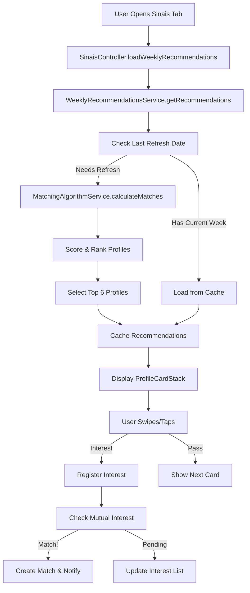

# Design Document - Aba Sinais com Recomendações Semanais

## Overview

A Aba Sinais implementa um sistema inovador de recomendações que prioriza compatibilidade de valores sobre aparência física. O design segue o princípio 50/50: metade da tela para foto, metade para valores e princípios espirituais. O sistema renova recomendações semanalmente (máximo 6 perfis) e utiliza o algoritmo de matching para calcular compatibilidade.

## Architecture

### Component Structure

```
SinaisView (Main Container)
├── SinaisController (State Management)
├── WeeklyRecommendationsService (Business Logic)
├── MatchingAlgorithmService (Score Calculation)
└── UI Components
    ├── ProfileCardStack (Card Container)
    │   └── ProfileRecommendationCard (Individual Card)
    │       ├── PhotoSection (50% superior)
    │       └── ValuesSection (50% inferior)
    │           ├── MatchScoreBadge
    │           ├── ValueHighlightChips
    │           └── ActionButtons
    ├── InterestsTab (Interesses Pendentes)
    ├── MatchesTab (Matches Confirmados)
    └── EmptyStateView (Sem Recomendações)
```

### Data Flow



## Components and Interfaces

### 1. SinaisView

**Responsabilidade**: Container principal da aba Sinais com navegação entre sub-abas

```dart
class SinaisView extends StatelessWidget {
  final SinaisController controller = Get.find();
  
  @override
  Widget build(BuildContext context) {
    return Scaffold(
      appBar: AppBar(
        title: Text('Sinais'),
        bottom: TabBar(
          tabs: [
            Tab(text: 'Recomendações'),
            Tab(text: 'Meus Interesses'),
            Tab(text: 'Matches'),
          ],
        ),
      ),
      body: TabBarView(
        children: [
          RecommendationsTab(),
          InterestsTab(),
          MatchesTab(),
        ],
      ),
    );
  }
}
```

### 2. ProfileRecommendationCard

**Responsabilidade**: Card individual de perfil com layout 50/50

**Props**:
- `ScoredProfile profile` - Perfil com score calculado
- `Function(String) onInterest` - Callback para demonstrar interesse
- `Function(String) onPass` - Callback para passar perfil
- `Function(String) onTapDetails` - Callback para expandir detalhes

**Layout**:
```
┌─────────────────────────────────┐
│                                 │
│         PHOTO SECTION           │
│         (50% height)            │
│                                 │
│    [Foto Principal Otimizada]   │
│                                 │
│  [Indicador: 1/4 fotos]         │
│                                 │
├─────────────────────────────────┤
│                                 │
│        VALUES SECTION           │
│         (50% height)            │
│                                 │
│  Nome, 28 • São Paulo, SP       │
│                                 │
│  ┌─────────────────────────┐   │
│  │ 🏆 Match: 95% ⓘ         │   │
│  └─────────────────────────┘   │
│                                 │
│  ✓ Certificação Espiritual      │
│  ✓ Membro Deus é Pai            │
│  ✓ Virgindade Preservada        │
│  📚 Ensino Superior             │
│  🌍 Português, Inglês           │
│  🎯 3 hobbies em comum          │
│                                 │
│  ┌──────────┐  ┌──────────┐    │
│  │ ❤️ Tenho  │  │ ✕ Passar │    │
│  │ Interesse│  │          │    │
│  └──────────┘  └──────────┘    │
│                                 │
└─────────────────────────────────┘
```

**Implementação**:
```dart
class ProfileRecommendationCard extends StatelessWidget {
  final ScoredProfile profile;
  final Function(String) onInterest;
  final Function(String) onPass;
  final Function(String) onTapDetails;
  
  @override
  Widget build(BuildContext context) {
    return Container(
      height: MediaQuery.of(context).size.height * 0.75,
      child: Column(
        children: [
          // Photo Section (50%)
          Expanded(
            flex: 1,
            child: PhotoSection(
              photos: profile.photos,
              onTap: () => onTapDetails(profile.userId),
            ),
          ),
          
          // Values Section (50%)
          Expanded(
            flex: 1,
            child: ValuesSection(
              profile: profile,
              onInterest: () => onInterest(profile.userId),
              onPass: () => onPass(profile.userId),
            ),
          ),
        ],
      ),
    );
  }
}
```

### 3. WeeklyRecommendationsService

**Responsabilidade**: Gerenciar ciclo semanal de recomendações

**Métodos Principais**:

```dart
class WeeklyRecommendationsService {
  final FirebaseFirestore _firestore = FirebaseFirestore.instance;
  
  /// Obtém recomendações da semana atual
  Future<List<ScoredProfile>> getWeeklyRecommendations(String userId) async {
    final weekKey = _getCurrentWeekKey();
    final cached = await _getCachedRecommendations(userId, weekKey);
    
    if (cached != null && cached.isNotEmpty) {
      return cached;
    }
    
    // Gerar novas recomendações
    final recommendations = await _generateRecommendations(userId);
    await _cacheRecommendations(userId, weekKey, recommendations);
    
    return recommendations;
  }
  
  /// Gera novas recomendações baseadas no matching
  Future<List<ScoredProfile>> _generateRecommendations(String userId) async {
    // 1. Buscar perfil e filtros do usuário
    final userProfile = await _getProfile(userId);
    final userFilters = await _getFilters(userId);
    
    // 2. Buscar perfis candidatos (excluir já visualizados, bloqueados, matches)
    final candidates = await _getCandidateProfiles(userId);
    
    // 3. Calcular scores usando MatchingAlgorithmService
    final scored = await MatchingAlgorithmService.scoreProfiles(
      userProfile: userProfile,
      userFilters: userFilters,
      candidates: candidates,
    );
    
    // 4. Ordenar por score e selecionar top 6
    scored.sort((a, b) => b.totalScore.compareTo(a.totalScore));
    return scored.take(6).toList();
  }
  
  /// Verifica se precisa renovar recomendações
  bool needsRefresh(DateTime lastRefresh) {
    final now = DateTime.now();
    final lastMonday = _getLastMonday(lastRefresh);
    final currentMonday = _getLastMonday(now);
    
    return currentMonday.isAfter(lastMonday);
  }
  
  /// Registra interesse em perfil
  Future<void> registerInterest(String fromUserId, String toUserId) async {
    await _firestore.collection('interests').add({
      'fromUserId': fromUserId,
      'toUserId': toUserId,
      'timestamp': FieldValue.serverTimestamp(),
      'status': 'pending',
    });
    
    // Verificar interesse mútuo
    final mutualInterest = await _checkMutualInterest(fromUserId, toUserId);
    
    if (mutualInterest) {
      await _createMatch(fromUserId, toUserId);
    }
  }
  
  /// Cria match quando há interesse mútuo
  Future<void> _createMatch(String user1Id, String user2Id) async {
    final matchId = _generateMatchId(user1Id, user2Id);
    
    await _firestore.collection('matches').doc(matchId).set({
      'users': [user1Id, user2Id],
      'createdAt': FieldValue.serverTimestamp(),
      'status': 'active',
    });
    
    // Atualizar status dos interesses
    await _updateInterestStatus(user1Id, user2Id, 'matched');
    
    // Enviar notificações
    await _sendMatchNotifications(user1Id, user2Id);
  }
  
  String _getCurrentWeekKey() {
    final now = DateTime.now();
    final monday = _getLastMonday(now);
    return '${monday.year}-W${_getWeekNumber(monday)}';
  }
  
  DateTime _getLastMonday(DateTime date) {
    final daysFromMonday = date.weekday - 1;
    return date.subtract(Duration(days: daysFromMonday));
  }
}
```

### 4. MatchScoreBadge

**Responsabilidade**: Exibir score de compatibilidade com breakdown

```dart
class MatchScoreBadge extends StatelessWidget {
  final MatchScore score;
  
  @override
  Widget build(BuildContext context) {
    return GestureDetector(
      onTap: () => _showScoreBreakdown(context),
      child: Container(
        padding: EdgeInsets.symmetric(horizontal: 16, vertical: 12),
        decoration: BoxDecoration(
          gradient: LinearGradient(
            colors: _getGradientColors(score.totalScore),
          ),
          borderRadius: BorderRadius.circular(12),
        ),
        child: Row(
          mainAxisSize: MainAxisSize.min,
          children: [
            Icon(Icons.favorite, color: Colors.white),
            SizedBox(width: 8),
            Text(
              '${score.totalScore}% Compatível',
              style: TextStyle(
                color: Colors.white,
                fontWeight: FontWeight.bold,
              ),
            ),
            SizedBox(width: 4),
            Icon(Icons.info_outline, size: 16, color: Colors.white70),
          ],
        ),
      ),
    );
  }
  
  void _showScoreBreakdown(BuildContext context) {
    showModalBottomSheet(
      context: context,
      builder: (context) => ScoreBreakdownSheet(score: score),
    );
  }
  
  List<Color> _getGradientColors(int score) {
    if (score >= 90) return [Colors.green[400]!, Colors.green[600]!];
    if (score >= 75) return [Colors.blue[400]!, Colors.blue[600]!];
    if (score >= 60) return [Colors.orange[400]!, Colors.orange[600]!];
    return [Colors.grey[400]!, Colors.grey[600]!];
  }
}
```

### 5. ValueHighlightChips

**Responsabilidade**: Exibir valores destacados com ícones

```dart
class ValueHighlightChips extends StatelessWidget {
  final ScoredProfile profile;
  
  @override
  Widget build(BuildContext context) {
    return Column(
      crossAxisAlignment: CrossAxisAlignment.start,
      children: [
        // Valores de alta prioridade (sempre visíveis)
        if (profile.hasCertification)
          _buildValueChip(
            icon: Icons.verified,
            label: 'Certificação Espiritual',
            color: Colors.amber,
            isHighlighted: true,
          ),
        
        if (profile.isDeusEPaiMember)
          _buildValueChip(
            icon: Icons.church,
            label: 'Membro Deus é Pai',
            color: Colors.indigo,
            isHighlighted: true,
          ),
        
        if (profile.virginityStatus != null)
          _buildValueChip(
            icon: Icons.favorite_border,
            label: 'Virgindade: ${profile.virginityStatus}',
            color: Colors.pink,
            isHighlighted: profile.matchesVirginityPreference,
          ),
        
        // Valores secundários
        _buildValueChip(
          icon: Icons.school,
          label: profile.education,
          color: Colors.blue,
        ),
        
        if (profile.languages.isNotEmpty)
          _buildValueChip(
            icon: Icons.language,
            label: profile.languages.join(', '),
            color: Colors.teal,
          ),
        
        if (profile.commonHobbies > 0)
          _buildValueChip(
            icon: Icons.interests,
            label: '${profile.commonHobbies} hobbies em comum',
            color: Colors.deepPurple,
            isHighlighted: profile.commonHobbies >= 3,
          ),
      ],
    );
  }
  
  Widget _buildValueChip({
    required IconData icon,
    required String label,
    required Color color,
    bool isHighlighted = false,
  }) {
    return Padding(
      padding: EdgeInsets.only(bottom: 8),
      child: Row(
        children: [
          Container(
            padding: EdgeInsets.all(6),
            decoration: BoxDecoration(
              color: isHighlighted ? color.withOpacity(0.2) : Colors.grey[100],
              borderRadius: BorderRadius.circular(8),
            ),
            child: Icon(
              icon,
              size: 18,
              color: isHighlighted ? color : Colors.grey[600],
            ),
          ),
          SizedBox(width: 8),
          Expanded(
            child: Text(
              label,
              style: TextStyle(
                fontSize: 14,
                fontWeight: isHighlighted ? FontWeight.w600 : FontWeight.normal,
                color: isHighlighted ? Colors.black87 : Colors.grey[700],
              ),
            ),
          ),
          if (isHighlighted)
            Icon(Icons.check_circle, size: 18, color: color),
        ],
      ),
    );
  }
}
```

## Data Models

### WeeklyRecommendation

```dart
class WeeklyRecommendation {
  final String userId;
  final String weekKey; // Format: "2025-W42"
  final List<String> profileIds;
  final DateTime generatedAt;
  final List<String> viewedProfiles;
  final List<String> passedProfiles;
  final List<String> interestedProfiles;
  
  WeeklyRecommendation({
    required this.userId,
    required this.weekKey,
    required this.profileIds,
    required this.generatedAt,
    this.viewedProfiles = const [],
    this.passedProfiles = const [],
    this.interestedProfiles = const [],
  });
  
  factory WeeklyRecommendation.fromFirestore(DocumentSnapshot doc) {
    final data = doc.data() as Map<String, dynamic>;
    return WeeklyRecommendation(
      userId: data['userId'],
      weekKey: data['weekKey'],
      profileIds: List<String>.from(data['profileIds'] ?? []),
      generatedAt: (data['generatedAt'] as Timestamp).toDate(),
      viewedProfiles: List<String>.from(data['viewedProfiles'] ?? []),
      passedProfiles: List<String>.from(data['passedProfiles'] ?? []),
      interestedProfiles: List<String>.from(data['interestedProfiles'] ?? []),
    );
  }
  
  Map<String, dynamic> toFirestore() {
    return {
      'userId': userId,
      'weekKey': weekKey,
      'profileIds': profileIds,
      'generatedAt': Timestamp.fromDate(generatedAt),
      'viewedProfiles': viewedProfiles,
      'passedProfiles': passedProfiles,
      'interestedProfiles': interestedProfiles,
    };
  }
}
```

### Interest

```dart
class Interest {
  final String id;
  final String fromUserId;
  final String toUserId;
  final DateTime timestamp;
  final String status; // 'pending', 'matched', 'expired'
  
  Interest({
    required this.id,
    required this.fromUserId,
    required this.toUserId,
    required this.timestamp,
    required this.status,
  });
  
  factory Interest.fromFirestore(DocumentSnapshot doc) {
    final data = doc.data() as Map<String, dynamic>;
    return Interest(
      id: doc.id,
      fromUserId: data['fromUserId'],
      toUserId: data['toUserId'],
      timestamp: (data['timestamp'] as Timestamp).toDate(),
      status: data['status'],
    );
  }
}
```

## Error Handling

### Cenários de Erro

1. **Sem perfis compatíveis**
   - Exibir EmptyStateView com sugestões
   - Sugerir ajuste de filtros ou completar perfil
   - Mostrar estatísticas de compatibilidade

2. **Erro ao carregar recomendações**
   - Retry automático (3 tentativas)
   - Fallback para cache local
   - Mensagem amigável ao usuário

3. **Erro ao registrar interesse**
   - Queue local para retry
   - Sincronização quando reconectar
   - Feedback visual de "processando"

4. **Perfil incompleto**
   - Bloquear acesso à aba Sinais
   - Direcionar para completar perfil
   - Mostrar progresso de completude

## Testing Strategy

### Unit Tests

```dart
// test/services/weekly_recommendations_service_test.dart
void main() {
  group('WeeklyRecommendationsService', () {
    test('should generate 6 recommendations', () async {
      final service = WeeklyRecommendationsService();
      final recommendations = await service.getWeeklyRecommendations('user123');
      expect(recommendations.length, lessThanOrEqualTo(6));
    });
    
    test('should refresh on Monday', () {
      final service = WeeklyRecommendationsService();
      final lastRefresh = DateTime(2025, 10, 13); // Sunday
      expect(service.needsRefresh(lastRefresh), isTrue);
    });
    
    test('should create match on mutual interest', () async {
      final service = WeeklyRecommendationsService();
      await service.registerInterest('user1', 'user2');
      await service.registerInterest('user2', 'user1');
      
      final match = await service.getMatch('user1', 'user2');
      expect(match, isNotNull);
    });
  });
}
```

### Integration Tests

```dart
// integration_test/sinais_flow_test.dart
void main() {
  testWidgets('Complete Sinais flow', (tester) async {
    // 1. Abrir aba Sinais
    await tester.tap(find.text('Sinais'));
    await tester.pumpAndSettle();
    
    // 2. Verificar cards carregados
    expect(find.byType(ProfileRecommendationCard), findsWidgets);
    
    // 3. Swipe para passar
    await tester.drag(find.byType(ProfileRecommendationCard), Offset(-300, 0));
    await tester.pumpAndSettle();
    
    // 4. Demonstrar interesse
    await tester.tap(find.text('Tenho Interesse'));
    await tester.pumpAndSettle();
    
    // 5. Verificar interesse registrado
    expect(find.text('Interesse enviado!'), findsOneWidget);
  });
}
```

## Performance Considerations

### Otimizações

1. **Carregamento de Imagens**
   - Usar cached_network_image com placeholder
   - Carregar apenas foto principal inicialmente
   - Lazy load de galeria completa

2. **Cálculo de Scores**
   - Cache de scores calculados (válido por 24h)
   - Cálculo assíncrono em background
   - Batch processing para múltiplos perfis

3. **Sincronização**
   - Sync incremental de interesses
   - Debounce de ações do usuário
   - Offline-first com queue local

4. **Animações**
   - Usar AnimatedSwitcher para transições
   - Hero animations para expansão de cards
   - 60 FPS garantido com RepaintBoundary

## Security Considerations

1. **Privacidade**
   - Não expor perfis já rejeitados
   - Limitar visualizações por semana
   - Ocultar perfis bloqueados

2. **Validações**
   - Verificar perfil completo antes de mostrar
   - Validar interesse mútuo no backend
   - Rate limiting de ações (max 10 interesses/dia)

3. **Firestore Rules**
```javascript
match /weeklyRecommendations/{userId} {
  allow read: if request.auth.uid == userId;
  allow write: if false; // Apenas backend pode escrever
}

match /interests/{interestId} {
  allow create: if request.auth.uid == request.resource.data.fromUserId;
  allow read: if request.auth.uid in [resource.data.fromUserId, resource.data.toUserId];
}

match /matches/{matchId} {
  allow read: if request.auth.uid in resource.data.users;
  allow write: if false; // Apenas backend pode criar matches
}
```
