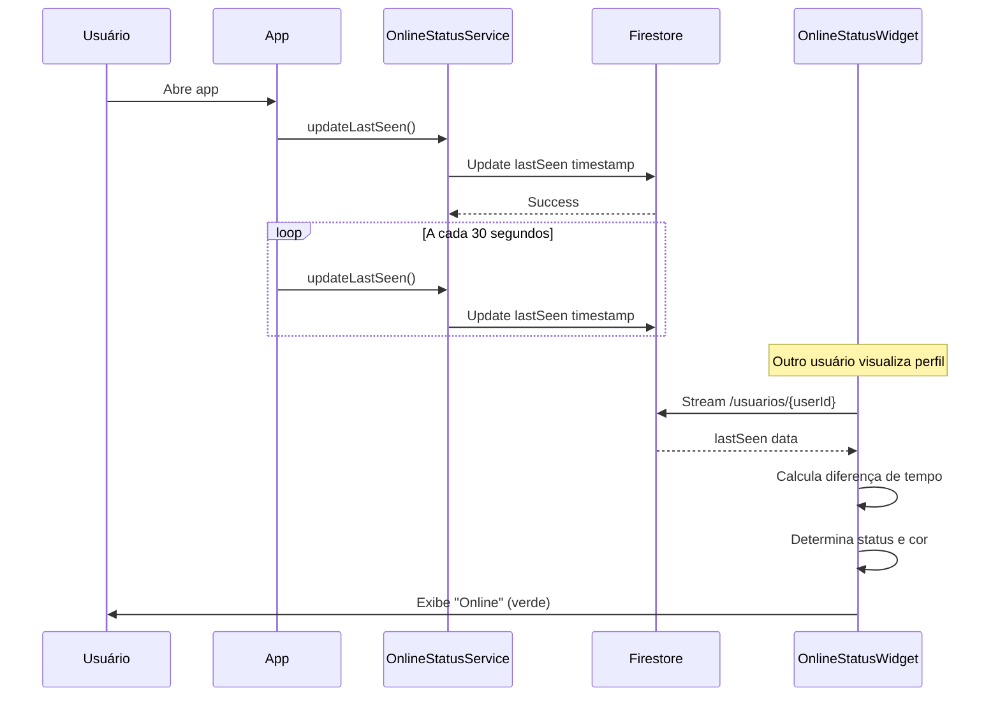

# Design Document

## Overview

Este documento descreve o design da solução para corrigir o problema de status online "há muito tempo" que aparece para usuários como @italolior. A solução envolve criar um componente reutilizável de status online e implementá-lo consistentemente em todas as views relevantes do aplicativo.

### Problema Identificado

Atualmente, o aplicativo tem múltiplas views de chat e perfil que exibem informações de usuários:

1. **ChatView** (antiga) - Atualiza `lastSeen` mas NÃO exibe status de outros usuários
2. **RomanticMatchChatView** (nova) - Atualiza E exibe status corretamente ✅
3. **MatchChatView** - Status desconhecido
4. **RobustMatchChatView** - Status desconhecido
5. **SimpleAcceptedMatchesView** - Lista matches mas não exibe status online
6. **ProfileDisplayView** - Exibe perfil mas não exibe status online
7. **InterestDashboardView** - Exibe interesses mas não exibe status online

**Resultado:** Inconsistência na exibição do status online, causando confusão para os usuários.

## Architecture

### Componente Central: OnlineStatusWidget

```
┌─────────────────────────────────────┐
│      OnlineStatusWidget             │
│  (Componente Reutilizável)          │
├─────────────────────────────────────┤
│ Input:                              │
│  - userId: String                   │
│  - showText: bool (default: true)   │
│  - showDot: bool (default: true)    │
│  - size: double (default: 12)       │
│  - textStyle: TextStyle?            │
├─────────────────────────────────────┤
│ Lógica:                             │
│  1. Stream do Firestore             │
│     /usuarios/{userId}              │
│  2. Lê campo lastSeen               │
│  3. Calcula diferença de tempo      │
│  4. Retorna status + cor            │
├─────────────────────────────────────┤
│ Output:                             │
│  - Indicador visual (dot)           │
│  - Texto de status                  │
│  - Cor baseada em tempo             │
└─────────────────────────────────────┘
```

### Fluxo de Dados

```
Firestore: /usuarios/{userId}
         ↓
    lastSeen: Timestamp
         ↓
OnlineStatusWidget (Stream)
         ↓
Calcula diferença: now - lastSeen
         ↓
┌─────────────────────────────────┐
│ < 5 min    → "Online" (verde)   │
│ 5-60 min   → "há X min" (amar.) │
│ 1-24 hrs   → "há X hrs" (laran.)│
│ > 24 hrs   → "há X dias" (cinza)│
│ null       → "há muito tempo"    │
└─────────────────────────────────┘
         ↓
    Exibe na UI
```

### Integração com Views Existentes

```
┌──────────────────────────────────────────┐
│           Views do App                   │
├──────────────────────────────────────────┤
│                                          │
│  ChatView                                │
│  ├─ AppBar                               │
│  │   └─ OnlineStatusWidget(adminUserId) │
│  └─ Body                                 │
│                                          │
│  RomanticMatchChatView (já tem)          │
│  ├─ AppBar                               │
│  │   └─ OnlineStatusWidget(otherUserId) │
│  └─ Body                                 │
│                                          │
│  SimpleAcceptedMatchesView               │
│  └─ ListView                             │
│      └─ MatchCard                        │
│          └─ OnlineStatusWidget(userId)   │
│                                          │
│  ProfileDisplayView                      │
│  ├─ AppBar                               │
│  │   └─ OnlineStatusWidget(userId)      │
│  └─ Body                                 │
│                                          │
│  InterestDashboardView                   │
│  └─ ListView                             │
│      └─ InterestCard                     │
│          └─ OnlineStatusWidget(userId)   │
│                                          │
└──────────────────────────────────────────┘
```

## Components and Interfaces

### 1. OnlineStatusWidget

**Localização:** `lib/components/online_status_widget.dart`

**Interface:**

```dart
class OnlineStatusWidget extends StatelessWidget {
  final String userId;
  final bool showText;
  final bool showDot;
  final double dotSize;
  final TextStyle? textStyle;
  final double fontSize;
  
  const OnlineStatusWidget({
    Key? key,
    required this.userId,
    this.showText = true,
    this.showDot = true,
    this.dotSize = 8,
    this.textStyle,
    this.fontSize = 11,
  }) : super(key: key);
  
  @override
  Widget build(BuildContext context) {
    return StreamBuilder<DocumentSnapshot>(
      stream: FirebaseFirestore.instance
          .collection('usuarios')
          .doc(userId)
          .snapshots(),
      builder: (context, snapshot) {
        // Lógica de cálculo de status
        final status = _calculateStatus(snapshot);
        return _buildStatusUI(status);
      },
    );
  }
  
  OnlineStatus _calculateStatus(AsyncSnapshot<DocumentSnapshot> snapshot);
  Widget _buildStatusUI(OnlineStatus status);
}
```

**Modelo de Dados:**

```dart
class OnlineStatus {
  final String text;
  final Color color;
  final bool isOnline;
  
  const OnlineStatus({
    required this.text,
    required this.color,
    required this.isOnline,
  });
}
```

### 2. Modificações no ChatView

**Localização:** `lib/views/chat_view.dart`

**Mudanças:**

1. Adicionar `OnlineStatusWidget` na AppBar
2. Exibir status do usuário admin/sistema
3. Posicionar próximo ao logo ou nome

**Implementação:**

```dart
// Na AppBar do ChatView
AppBar(
  title: Row(
    children: [
      Text('Chat Principal'),
      SizedBox(width: 8),
      OnlineStatusWidget(
        userId: 'ADMIN_USER_ID', // ID do usuário admin
        showDot: true,
        showText: true,
        fontSize: 10,
      ),
    ],
  ),
)
```

### 3. Modificações no SimpleAcceptedMatchesView

**Localização:** `lib/views/simple_accepted_matches_view.dart`

**Mudanças:**

1. Adicionar `OnlineStatusWidget` em cada card de match
2. Exibir status do outro usuário
3. Posicionar abaixo do nome

**Implementação:**

```dart
// No card de cada match
ListTile(
  title: Text(match.otherUserName),
  subtitle: OnlineStatusWidget(
    userId: match.otherUserId,
    showDot: true,
    showText: true,
    fontSize: 11,
  ),
)
```

### 4. Modificações no ProfileDisplayView

**Localização:** `lib/views/profile_display_view.dart`

**Mudanças:**

1. Adicionar `OnlineStatusWidget` na AppBar ou próximo ao nome
2. Exibir status do usuário visualizado

**Implementação:**

```dart
// Na AppBar do ProfileDisplayView
AppBar(
  title: Column(
    crossAxisAlignment: CrossAxisAlignment.start,
    children: [
      Text(userName),
      OnlineStatusWidget(
        userId: widget.userId,
        showDot: true,
        showText: true,
        fontSize: 10,
      ),
    ],
  ),
)
```

### 5. Modificações no InterestDashboardView

**Localização:** `lib/views/interest_dashboard_view.dart`

**Mudanças:**

1. Adicionar `OnlineStatusWidget` em cada card de interesse
2. Exibir status do usuário que enviou/recebeu interesse

## Data Models

### Firestore Schema

**Collection:** `usuarios`

```json
{
  "userId": "DSMhyNtfPAe9jZtjkon34Zi7eit2",
  "nome": "Italo Lior",
  "email": "italolior@gmail.com",
  "lastSeen": Timestamp(2025-10-22 14:30:00),
  "imgUrl": "https://...",
  ...
}
```

**Campo Crítico:** `lastSeen` (Timestamp)

- Atualizado automaticamente pelo `OnlineStatusService`
- Usado pelo `OnlineStatusWidget` para calcular status
- Deve existir para todos os usuários

### Regras de Cálculo de Status

| Diferença de Tempo | Status Exibido | Cor | Código |
|-------------------|----------------|-----|--------|
| < 5 minutos | "Online" | Verde (#4CAF50) | `isOnline = true` |
| 5-60 minutos | "Online há X minutos" | Amarelo (#FFC107) | `isOnline = false` |
| 1-24 horas | "Online há X horas" | Laranja (#FF9800) | `isOnline = false` |
| > 24 horas | "Online há X dias" | Cinza (#9E9E9E) | `isOnline = false` |
| null ou erro | "Online há muito tempo" | Cinza (#9E9E9E) | `isOnline = false` |

## Error Handling

### Cenários de Erro

1. **userId não existe no Firestore**
   - Exibir: "Online há muito tempo" (cinza)
   - Log: Warning no console

2. **lastSeen é null**
   - Exibir: "Online há muito tempo" (cinza)
   - Não é erro, apenas usuário antigo

3. **Erro de conexão com Firestore**
   - Exibir: Último status conhecido (cache)
   - Retry automático via Stream

4. **Permissões negadas**
   - Exibir: "Status indisponível"
   - Log: Error no console

### Implementação de Error Handling

```dart
StreamBuilder<DocumentSnapshot>(
  stream: _getUserStream(userId),
  builder: (context, snapshot) {
    // Erro de conexão
    if (snapshot.hasError) {
      return _buildErrorStatus();
    }
    
    // Carregando
    if (!snapshot.hasData) {
      return _buildLoadingStatus();
    }
    
    // Documento não existe
    if (!snapshot.data!.exists) {
      return _buildUnknownStatus();
    }
    
    // Sucesso
    final data = snapshot.data!.data() as Map<String, dynamic>?;
    final lastSeen = data?['lastSeen'] as Timestamp?;
    
    // lastSeen null
    if (lastSeen == null) {
      return _buildLongTimeAgoStatus();
    }
    
    // Calcular status normal
    return _buildNormalStatus(lastSeen);
  },
)
```

## Testing Strategy

### Testes Unitários

**Arquivo:** `test/components/online_status_widget_test.dart`

**Casos de Teste:**

1. **Teste de cálculo de status**
   - Input: lastSeen há 3 minutos
   - Expected: "Online" (verde)

2. **Teste de cálculo de status**
   - Input: lastSeen há 30 minutos
   - Expected: "Online há 30 minutos" (amarelo)

3. **Teste de cálculo de status**
   - Input: lastSeen há 5 horas
   - Expected: "Online há 5 horas" (laranja)

4. **Teste de cálculo de status**
   - Input: lastSeen há 3 dias
   - Expected: "Online há 3 dias" (cinza)

5. **Teste de lastSeen null**
   - Input: lastSeen = null
   - Expected: "Online há muito tempo" (cinza)

### Testes de Integração

**Arquivo:** `test/integration/online_status_integration_test.dart`

**Casos de Teste:**

1. **ChatView exibe status**
   - Abrir ChatView
   - Verificar que OnlineStatusWidget está presente
   - Verificar que exibe status correto

2. **SimpleAcceptedMatchesView exibe status**
   - Abrir lista de matches
   - Verificar que cada card tem OnlineStatusWidget
   - Verificar que exibe status correto para cada usuário

3. **ProfileDisplayView exibe status**
   - Abrir perfil de usuário
   - Verificar que OnlineStatusWidget está presente
   - Verificar que exibe status correto

### Testes Manuais

**Checklist de Teste Manual:**

1. **Teste com @italolior:**
   - [ ] Login com @italolior
   - [ ] Abrir ChatView
   - [ ] Verificar que lastSeen é atualizado no Firestore
   - [ ] Outro usuário visualiza @italolior
   - [ ] Verificar que status exibe "Online" ou "há X minutos"
   - [ ] @italolior fecha app
   - [ ] Aguardar 10 minutos
   - [ ] Verificar que status exibe "há 10 minutos"

2. **Teste de atualização em tempo real:**
   - [ ] Usuário A abre perfil de Usuário B
   - [ ] Verificar status inicial
   - [ ] Usuário B abre o app
   - [ ] Verificar que status de Usuário B atualiza automaticamente
   - [ ] Usuário B fecha o app
   - [ ] Verificar que status atualiza após alguns minutos

3. **Teste de múltiplas views:**
   - [ ] Abrir ChatView - verificar status
   - [ ] Abrir SimpleAcceptedMatchesView - verificar status
   - [ ] Abrir ProfileDisplayView - verificar status
   - [ ] Abrir InterestDashboardView - verificar status
   - [ ] Todos devem exibir status consistente

## Performance Considerations

### Otimizações

1. **Cache de Streams:**
   - Usar `StreamProvider` para compartilhar streams entre widgets
   - Evitar múltiplos listeners para o mesmo userId

2. **Debounce de Atualizações:**
   - Atualizar UI apenas quando status muda (não a cada segundo)
   - Usar `distinct()` no Stream

3. **Lazy Loading:**
   - Carregar status apenas quando widget está visível
   - Usar `AutomaticKeepAliveClientMixin` quando apropriado

4. **Limit de Queries:**
   - Usar cache do Firestore
   - Configurar persistence: `persistenceEnabled: true`

### Monitoramento

- Log de performance no console (debug mode)
- Tracking de erros de conexão
- Métricas de latência de atualização

## Migration Plan

### Fase 1: Criar Componente (1-2 horas)
1. Criar `OnlineStatusWidget`
2. Implementar lógica de cálculo
3. Testar isoladamente

### Fase 2: Implementar no ChatView (30 minutos)
1. Adicionar import
2. Adicionar widget na AppBar
3. Testar com @italolior

### Fase 3: Implementar em Outras Views (2-3 horas)
1. SimpleAcceptedMatchesView
2. ProfileDisplayView
3. InterestDashboardView
4. Outras views conforme necessário

### Fase 4: Testes (1-2 horas)
1. Testes unitários
2. Testes de integração
3. Testes manuais com usuários reais

### Fase 5: Deploy e Monitoramento (1 dia)
1. Deploy para produção
2. Monitorar logs
3. Coletar feedback de usuários

## Design Decisions

### Por que um componente reutilizável?

**Decisão:** Criar `OnlineStatusWidget` ao invés de duplicar código.

**Razões:**
- ✅ Consistência: Todos usam mesma lógica
- ✅ Manutenibilidade: Mudanças em um lugar
- ✅ Testabilidade: Testar uma vez
- ✅ Reutilização: Fácil adicionar em novas views

### Por que usar Stream ao invés de FutureBuilder?

**Decisão:** Usar `StreamBuilder` para atualizações em tempo real.

**Razões:**
- ✅ Tempo real: Status atualiza automaticamente
- ✅ Eficiência: Firestore envia apenas mudanças
- ✅ UX: Usuário vê status atualizado sem refresh

### Por que não migrar ChatView para match_chats?

**Decisão:** Manter ChatView como está, apenas adicionar status online.

**Razões:**
- ✅ Menos risco: Não quebra funcionalidade existente
- ✅ Mais rápido: Solução focada no problema
- ✅ Reversível: Fácil reverter se necessário
- ⚠️ Dívida técnica: Ainda temos 2 sistemas de chat

**Nota:** Migração completa pode ser feita em spec separada no futuro.

## Diagrams

### Fluxo de Atualização de Status



### Arquitetura de Componentes

```mermaid
graph TD
    A[OnlineStatusWidget] --> B[StreamBuilder]
    B --> C[Firestore Stream]
    C --> D[/usuarios/{userId}]
    
    B --> E[_calculateStatus]
    E --> F{lastSeen?}
    F -->|null| G[há muito tempo]
    F -->|< 5 min| H[Online]
    F -->|5-60 min| I[há X min]
    F -->|1-24 hrs| J[há X hrs]
    F -->|> 24 hrs| K[há X dias]
    
    G --> L[_buildStatusUI]
    H --> L
    I --> L
    J --> L
    K --> L
    
    L --> M[Row: Dot + Text]
    M --> N[Exibe na UI]
```

## Conclusion

Esta solução resolve o problema de status online de forma:
- **Consistente:** Todas as views usam mesma lógica
- **Escalável:** Fácil adicionar em novas views
- **Manutenível:** Código centralizado e testável
- **Performática:** Usa Streams e cache do Firestore

O componente `OnlineStatusWidget` se torna a fonte única de verdade para exibição de status online no aplicativo.
