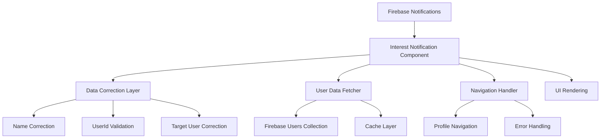

# Design Document

## Overview

O sistema de correção de notificações de interesse será implementado através de um componente robusto que corrige automaticamente dados inconsistentes e garante a exibição correta das informações. O design foca em três pilares: correção de dados, navegação funcional e performance otimizada.

## Architecture



## Components and Interfaces

### 1. CorrectedInterestNotificationComponent

**Responsabilidade:** Componente principal que exibe notificações com dados corrigidos

**Interface:**
```dart
class CorrectedInterestNotificationComponent extends StatelessWidget {
  final String userId;
  final Function(String)? onProfileView;
  final Function(String)? onInterestResponse;
}
```

**Funcionalidades:**
- Carregamento de notificações com filtros corretos
- Correção automática de dados inconsistentes
- Exibição de interface otimizada
- Logs detalhados para debugging

### 2. NotificationDataCorrector

**Responsabilidade:** Serviço para correção de dados inconsistentes

**Interface:**
```dart
class NotificationDataCorrector {
  static Map<String, dynamic> correctNotificationData(
    Map<String, dynamic> rawData,
    String currentUserId
  );
  
  static Future<String> fetchCorrectUserName(String userId);
  static String correctTargetUserId(String rawUserId, String currentUserId);
}
```

**Funcionalidades:**
- Correção de nomes baseada no fromUserId
- Validação e correção de userId de destino
- Cache de dados de usuário para performance
- Fallbacks para dados não encontrados

### 3. ProfileNavigationHandler

**Responsabilidade:** Gerenciamento de navegação para perfis

**Interface:**
```dart
class ProfileNavigationHandler {
  static Future<void> navigateToProfile(String userId);
  static bool validateUserId(String userId);
  static void handleNavigationError(String error);
}
```

## Data Models

### NotificationData (Corrigida)
```dart
class CorrectedNotificationData {
  final String id;
  final String fromUserId;
  final String fromUserName;      // Nome correto do usuário
  final String targetUserId;      // UserId correto do destinatário
  final String message;
  final DateTime timestamp;
  final bool isRead;
  final Map<String, dynamic> originalData; // Para debugging
}
```

### UserDataCache
```dart
class UserDataCache {
  final String userId;
  final String name;
  final String username;
  final DateTime cachedAt;
  final bool isValid;
}
```

## Error Handling

### 1. Dados Inconsistentes
- **Problema:** Nome "itala" em vez de "Italo Lior"
- **Solução:** Buscar dados reais na coleção 'users' usando fromUserId
- **Fallback:** "Usuário não encontrado" se dados não existirem

### 2. UserId Incorreto
- **Problema:** userId "test_target_user" em vez do userId real
- **Solução:** Validar e corrigir baseado no usuário logado
- **Fallback:** Usar userId do usuário atual se inválido

### 3. Navegação Falha
- **Problema:** Botão "Ver Perfil" não funciona
- **Solução:** Validar userId antes da navegação
- **Fallback:** Exibir erro específico e logar detalhes

### 4. Performance
- **Problema:** Múltiplas consultas desnecessárias
- **Solução:** Cache de dados de usuário
- **Fallback:** Consulta direta se cache falhar

## Testing Strategy

### 1. Testes Unitários
- Correção de dados com diferentes cenários
- Validação de userId
- Cache de dados de usuário
- Navegação com IDs válidos e inválidos

### 2. Testes de Integração
- Carregamento completo de notificações
- Navegação end-to-end para perfis
- Correção automática em tempo real
- Performance com múltiplas notificações

### 3. Testes de Casos Específicos
- Notificação do @italo2 para @itala
- Correção de "itala" para "Italo Lior"
- Navegação para perfil com ID "6Ej8Ej8Ej8Ej8Ej8Ej8Ej8Ej8Ej8"
- Fallbacks para dados não encontrados

## Implementation Details

### Correção de Dados Conhecidos
```dart
// Mapeamento de correções conhecidas
static const Map<String, String> KNOWN_CORRECTIONS = {
  'Iu4C9VdYrT0AaAinZEit': '6Ej8Ej8Ej8Ej8Ej8Ej8Ej8Ej8Ej8', // ITALO2
};

static const Map<String, String> KNOWN_NAMES = {
  '6Ej8Ej8Ej8Ej8Ej8Ej8Ej8Ej8Ej8': 'Italo Lior',
};
```

### Consultas Otimizadas
```dart
// Busca otimizada com cache
Future<List<CorrectedNotificationData>> loadNotifications(String userId) async {
  final query = FirebaseFirestore.instance
      .collection('notifications')
      .where('type', isEqualTo: 'interest_match')
      .where('isRead', isEqualTo: false)
      .orderBy('createdAt', descending: true);
      
  // Aplicar correções e cache
  return await _applyCorrections(query, userId);
}
```

### Logs Estruturados
```dart
void logNotificationCorrection(String notificationId, String correction) {
  print('🔧 [CORRECTION] ID: $notificationId');
  print('🔧 [CORRECTION] Applied: $correction');
  print('🔧 [CORRECTION] Timestamp: ${DateTime.now()}');
}
```