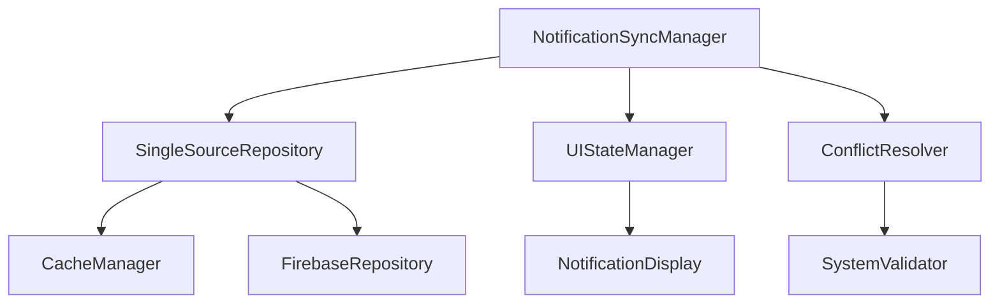

# Design Document - Correção de Sincronização de Notificações

## Overview

Este design implementa uma solução unificada para resolver o problema crítico de sincronização entre múltiplos sistemas de notificação, garantindo que as notificações criadas apareçam consistentemente na interface do usuário.

## Architecture

### Sistema Unificado de Notificações



### Fluxo de Dados Unificado

1. **Ponto Único de Entrada**: Todas as requisições passam pelo `NotificationSyncManager`
2. **Cache Centralizado**: Um único cache compartilhado entre todos os sistemas
3. **Validação Contínua**: Verificação automática de consistência
4. **Recuperação Automática**: Mecanismos de auto-correção

## Components and Interfaces

### NotificationSyncManager

```dart
class NotificationSyncManager {
  // Ponto único de controle para todas as notificações
  Stream<List<RealNotificationModel>> getNotificationsStream(String userId);
  Future<void> forceSync(String userId);
  Future<void> validateConsistency(String userId);
  void resolveConflicts();
}
```

### SingleSourceRepository

```dart
class SingleSourceRepository {
  // Repositório unificado que elimina conflitos
  Future<List<RealNotificationModel>> getNotifications(String userId);
  Stream<List<RealNotificationModel>> watchNotifications(String userId);
  Future<void> invalidateCache(String userId);
}
```

### ConflictResolver

```dart
class ConflictResolver {
  // Resolve conflitos entre sistemas diferentes
  Future<List<RealNotificationModel>> resolveInconsistencies(
    List<RealNotificationModel> source1,
    List<RealNotificationModel> source2
  );
  bool detectConflict(List<RealNotificationModel> notifications);
  Future<void> forceConsistency(String userId);
}
```

### UIStateManager

```dart
class UIStateManager {
  // Gerencia estado da interface de forma consistente
  void updateNotificationState(List<RealNotificationModel> notifications);
  void showSyncStatus(SyncStatus status);
  void triggerUIRefresh();
}
```

## Data Models

### SyncStatus

```dart
enum SyncStatus {
  syncing,
  synced,
  conflict,
  error,
  forceSync
}

class NotificationSyncState {
  final SyncStatus status;
  final List<RealNotificationModel> notifications;
  final DateTime lastSync;
  final String? errorMessage;
  final bool hasConflicts;
}
```

### ConflictResolution

```dart
class ConflictResolution {
  final List<RealNotificationModel> resolvedNotifications;
  final List<String> conflictSources;
  final ResolutionStrategy strategy;
  final DateTime resolvedAt;
}

enum ResolutionStrategy {
  useLatest,
  merge,
  forceRefresh,
  userChoice
}
```

## Error Handling

### Estratégias de Recuperação

1. **Detecção Automática**: Sistema monitora inconsistências continuamente
2. **Recuperação Gradual**: Tenta resolver conflitos sem interromper o usuário
3. **Fallback Robusto**: Em caso de falha, força sincronização completa
4. **Notificação ao Usuário**: Informa sobre problemas e soluções

### Logging Estruturado

```dart
class NotificationSyncLogger {
  void logConflictDetected(String userId, List<String> sources);
  void logResolutionAttempt(String userId, ResolutionStrategy strategy);
  void logSyncSuccess(String userId, int notificationCount);
  void logForceSync(String userId, String reason);
}
```

## Testing Strategy

### Testes de Integração

1. **Cenário de Conflito**: Simula múltiplos sistemas buscando simultaneamente
2. **Teste de Recuperação**: Verifica auto-correção após inconsistências
3. **Teste de Performance**: Garante que unificação não impacta velocidade
4. **Teste de UI**: Valida que interface reflete estado correto

### Testes de Stress

1. **Múltiplas Requisições**: Simula carga alta de sincronização
2. **Falhas de Rede**: Testa comportamento com conectividade instável
3. **Cache Corruption**: Verifica recuperação de cache corrompido
4. **Concorrência**: Testa acesso simultâneo por múltiplos componentes

## Implementation Strategy

### Fase 1: Unificação de Repositórios
- Criar `NotificationSyncManager` como ponto único
- Migrar todos os sistemas existentes para usar o manager
- Implementar cache centralizado

### Fase 2: Resolução de Conflitos
- Implementar `ConflictResolver`
- Adicionar detecção automática de inconsistências
- Criar mecanismos de recuperação

### Fase 3: Interface Unificada
- Atualizar todos os componentes UI para usar estado unificado
- Implementar feedback visual de sincronização
- Adicionar controles manuais de força de sync

### Fase 4: Monitoramento e Logs
- Implementar logging estruturado
- Adicionar métricas de performance
- Criar alertas automáticos para problemas

## Migration Plan

### Compatibilidade Reversa
- Manter APIs existentes funcionando durante transição
- Implementar adaptadores para sistemas legados
- Migração gradual sem interrupção de serviço

### Rollback Strategy
- Capacidade de reverter para sistema anterior se necessário
- Flags de feature para controlar ativação
- Monitoramento contínuo durante migração