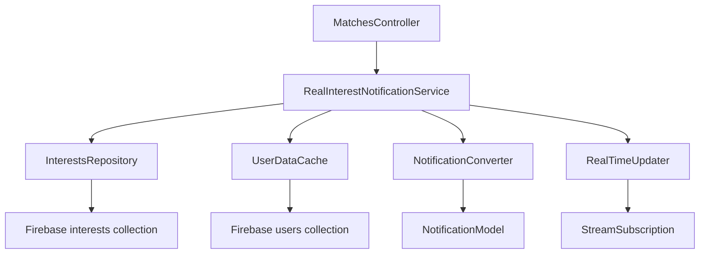

# Design Document

## Overview

O sistema atual de notificações reais tem falhas na busca e conversão de interações do Firebase. O design proposto corrige essas falhas implementando uma busca mais robusta, cache de dados de usuário e conversão adequada de interações em notificações.

## Architecture



## Components and Interfaces

### RealInterestNotificationService
- **Purpose**: Serviço principal para buscar e converter notificações reais
- **Methods**:
  - `getRealInterestNotifications(String userId)`: Busca notificações reais para um usuário
  - `subscribeToRealTimeUpdates(String userId)`: Subscreve a atualizações em tempo real
  - `refreshNotifications(String userId)`: Força atualização das notificações

### InterestsRepository
- **Purpose**: Repository para acessar a coleção interests do Firebase
- **Methods**:
  - `getInterestsForUser(String userId)`: Busca interesses onde o usuário é destinatário
  - `streamInterestsForUser(String userId)`: Stream de interesses em tempo real
  - `getInterestById(String interestId)`: Busca interesse específico

### UserDataCache
- **Purpose**: Cache para dados de usuários para evitar múltiplas consultas
- **Methods**:
  - `getUserData(String userId)`: Busca dados do usuário (cache first)
  - `preloadUsers(List<String> userIds)`: Pré-carrega dados de múltiplos usuários
  - `clearCache()`: Limpa o cache

### NotificationConverter
- **Purpose**: Converte interações em notificações formatadas
- **Methods**:
  - `convertInterestToNotification(Interest interest, UserData userData)`: Converte interesse em notificação
  - `formatNotificationData(NotificationData data)`: Formata dados da notificação

## Data Models

### Interest Model
```dart
class Interest {
  final String id;
  final String from; // userId que demonstrou interesse
  final String to;   // userId que recebeu interesse
  final DateTime timestamp;
  final String? message;
  final Map<String, dynamic>? metadata;
}
```

### RealNotification Model
```dart
class RealNotification {
  final String id;
  final String type; // 'interest'
  final String fromUserId;
  final String fromUserName;
  final String? fromUserPhoto;
  final DateTime timestamp;
  final String message;
  final bool isRead;
}
```

### UserData Model
```dart
class UserData {
  final String userId;
  final String name;
  final String? displayName;
  final String? photoUrl;
  final DateTime? lastUpdated;
}
```

## Error Handling

### Firebase Query Errors
- **Strategy**: Retry com backoff exponencial
- **Fallback**: Usar dados do cache se disponível
- **Logging**: Log detalhado de erros para debug

### User Data Missing
- **Strategy**: Usar dados de fallback (userId como nome)
- **Fallback**: Mostrar notificação com dados limitados
- **Recovery**: Tentar buscar dados em background

### Network Issues
- **Strategy**: Usar dados do cache local
- **Fallback**: Mostrar indicador de offline
- **Recovery**: Sincronizar quando conexão retornar

## Testing Strategy

### Unit Tests
- `RealInterestNotificationService`: Testa busca e conversão de notificações
- `InterestsRepository`: Testa queries do Firebase
- `UserDataCache`: Testa cache e invalidação
- `NotificationConverter`: Testa conversão de dados

### Integration Tests
- Fluxo completo: interesse → notificação → exibição
- Teste com dados reais do Firebase
- Teste de performance com múltiplas notificações

### Manual Tests
- Demonstrar interesse e verificar notificação
- Testar com usuários sem foto/nome
- Testar com conexão instável

## Implementation Notes

### Firebase Query Optimization
- Usar índices compostos para queries eficientes
- Limitar resultados com paginação
- Usar cache do Firebase quando possível

### Real-time Updates
- Usar Firestore streams para atualizações automáticas
- Implementar debounce para evitar updates excessivos
- Gerenciar subscriptions para evitar memory leaks

### Performance Considerations
- Cache de dados de usuário com TTL
- Lazy loading de fotos de perfil
- Batch requests para múltiplos usuários