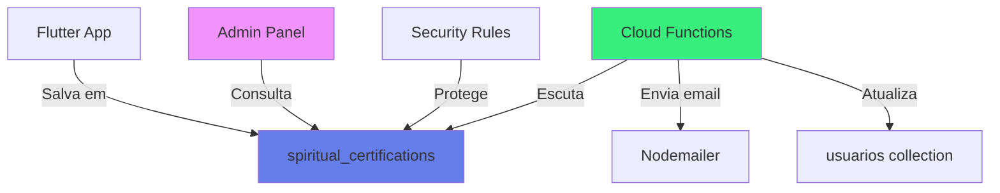

# Design Document

## Overview

Este documento detalha o design técnico para reverter o sistema de certificação espiritual para a configuração do backup funcional. A análise revelou que o backup usava `spiritual_certifications` como collection e campos `createdAt`/`processedAt`, enquanto as correções anteriores mudaram para `certification_requests` com campos `requestedAt`/`reviewedAt`.

## Root Cause Analysis

**Problema identificado:**
- Backup funcional: collection `spiritual_certifications` + campos `createdAt`, `processedAt`
- Código atual: collection `certification_requests` + campos `requestedAt`, `reviewedAt`
- Resultado: Documentos salvos não aparecem porque estão em collections diferentes

**Evidência:**
- Documento `wFOUgKdItJ88PaIUjmlf` não existe em `certification_requests`
- Backup do repository e service usavam `spiritual_certifications`
- Cloud Functions do backup escutavam `spiritual_certifications`

## Architecture

### Collection Structure

```
Firestore
└── spiritual_certifications/
    └── {certificationId}
        ├── userId: string
        ├── userName: string
        ├── userEmail: string
        ├── purchaseEmail: string
        ├── proofFileUrl: string
        ├── status: 'pending' | 'approved' | 'rejected'
        ├── createdAt: Timestamp
        ├── processedAt: Timestamp (opcional)
        ├── processedBy: string (opcional)
        ├── reviewedBy: string (opcional)
        ├── reviewedAt: Timestamp (opcional)
        └── rejectionReason: string (opcional)
```

### Component Diagram



## Components and Interfaces

### 1. SpiritualCertificationRepository

**Responsabilidade:** Gerenciar operações CRUD na collection `spiritual_certifications`

**Mudanças necessárias:**
```dart
// ANTES (atual - incorreto)
static const String _collectionName = 'certification_requests';
.orderBy('requestedAt', descending: true)

// DEPOIS (backup - correto)
static const String _collectionName = 'spiritual_certifications';
.orderBy('createdAt', descending: true)
```

**Métodos afetados:**
- `createRequest()` - Salvar em `spiritual_certifications`
- `getByUserId()` - Ordenar por `createdAt`
- `getPendingRequests()` - Ordenar por `createdAt`
- `getLatestRequest()` - Ordenar por `createdAt`

### 2. CertificationApprovalService

**Responsabilidade:** Gerenciar aprovação/reprovação de certificações

**Mudanças necessárias:**
```dart
// ANTES (atual - inconsistente)
.collection('certification_requests')  // Algumas queries
.collection('spiritual_certifications')  // Outras queries
.orderBy('requestedAt', descending: true)
.orderBy('reviewedAt', descending: true)

// DEPOIS (backup - consistente)
.collection('spiritual_certifications')  // Todas as queries
.orderBy('createdAt', descending: true)
.orderBy('processedAt', descending: true)
```

**Métodos afetados:**
- `getPendingCertificationsStream()` - Collection + ordenação
- `getCertificationHistoryStream()` - Collection + ordenação
- `approveCertification()` - Collection + campo `processedAt`
- `rejectCertification()` - Collection + campo `processedAt`
- `getCertificationById()` - Collection
- `getPendingCount()` - Collection
- `getPendingCountStream()` - Collection
- `hasApprovedCertification()` - Collection
- `getUserCertifications()` - Collection + ordenação

### 3. Cloud Functions (functions/index.js)

**Responsabilidade:** Enviar emails e processar aprovações via link

**Mudanças necessárias:**
```javascript
// ANTES (atual - incorreto)
.document("certification_requests/{requestId}")
requestData.requestedAt

// DEPOIS (backup - correto)
.document("spiritual_certifications/{requestId}")
requestData.createdAt
```

**Functions afetadas:**
- `sendCertificationRequestEmail` - Trigger path + campo `createdAt`
- `sendCertificationApprovalEmail` - Trigger path + campo `processedAt`
- `processApproval` - Collection query
- `processRejection` - Collection query

### 4. Firestore Security Rules

**Responsabilidade:** Proteger acesso à collection

**Mudanças necessárias:**
```
// ANTES (atual - duplicado)
match /spiritual_certifications/{certificationId} { ... }
match /certification_requests/{requestId} { ... }

// DEPOIS (backup - único)
match /spiritual_certifications/{certificationId} { 
  // Regras consolidadas
  // Validar campo 'proofFileUrl' (não 'proofUrl')
}
```

**Validações importantes:**
- Campo obrigatório: `proofFileUrl` (não `proofUrl`)
- Campos de data: `createdAt`, `processedAt`
- Status válidos: `pending`, `approved`, `rejected`

### 5. CertificationRequestModel

**Responsabilidade:** Modelo de dados para certificações

**Análise:** O modelo já deve estar correto, mas precisa garantir:
- Método `toFirestore()` usa campos corretos
- Método `fromFirestore()` lê campos corretos
- Método `fromMap()` suporta ambos os formatos (transição)

## Data Models

### CertificationRequest

```dart
class CertificationRequestModel {
  final String? id;
  final String userId;
  final String userName;
  final String userEmail;
  final String purchaseEmail;
  final String proofFileUrl;  // NÃO proofUrl
  final CertificationStatus status;
  final DateTime createdAt;  // NÃO requestedAt
  final DateTime? processedAt;  // NÃO reviewedAt
  final String? processedBy;
  final String? reviewedBy;
  final DateTime? reviewedAt;
  final String? rejectionReason;
  
  // Métodos de serialização devem usar nomes corretos
  Map<String, dynamic> toFirestore() {
    return {
      'userId': userId,
      'userName': userName,
      'userEmail': userEmail,
      'purchaseEmail': purchaseEmail,
      'proofFileUrl': proofFileUrl,
      'status': status.name,
      'createdAt': Timestamp.fromDate(createdAt),
      'processedAt': processedAt != null ? Timestamp.fromDate(processedAt!) : null,
      // ...
    };
  }
}
```

## Error Handling

### Estratégia de Migração

**Problema:** Pode haver documentos em ambas as collections durante transição

**Solução:**
1. Reverter código para usar `spiritual_certifications`
2. Verificar se há documentos em `certification_requests`
3. Se houver, migrar manualmente para `spiritual_certifications`
4. Manter regras de segurança apenas para `spiritual_certifications`

### Validação de Campos

**Problema:** Código pode tentar acessar campos inexistentes

**Solução:**
```dart
// Método fromFirestore deve ser robusto
factory CertificationRequestModel.fromFirestore(DocumentSnapshot doc) {
  final data = doc.data() as Map<String, dynamic>;
  
  // Suportar ambos os formatos durante transição
  final createdAt = data['createdAt'] ?? data['requestedAt'];
  final processedAt = data['processedAt'] ?? data['reviewedAt'];
  
  return CertificationRequestModel(
    id: doc.id,
    createdAt: (createdAt as Timestamp).toDate(),
    processedAt: processedAt != null ? (processedAt as Timestamp).toDate() : null,
    // ...
  );
}
```

## Testing Strategy

### 1. Unit Tests (Opcional)

**Repository Tests:**
- Verificar que `_collectionName` é `spiritual_certifications`
- Verificar que queries usam `createdAt` e `processedAt`

**Service Tests:**
- Verificar que todas as queries usam collection correta
- Verificar que campos de data são corretos

### 2. Integration Tests

**Fluxo completo:**
1. Criar certificação no app
2. Verificar documento em `spiritual_certifications`
3. Verificar campos `createdAt`, `proofFileUrl`, `status`
4. Aprovar via painel admin
5. Verificar campo `processedAt` atualizado
6. Verificar email enviado

**Cloud Functions:**
1. Criar documento em `spiritual_certifications`
2. Verificar trigger de email disparado
3. Verificar email recebido com dados corretos

### 3. Manual Testing

**Checklist:**
- [ ] App salva em `spiritual_certifications`
- [ ] Documento aparece no Firebase Console
- [ ] Painel admin lista certificações pendentes
- [ ] Aprovação atualiza `processedAt`
- [ ] Email é enviado ao criar certificação
- [ ] Email é enviado ao aprovar/reprovar
- [ ] Regras de segurança permitem operações

## Deployment Strategy

### Ordem de Deploy

1. **Atualizar Firestore Rules**
   - Consolidar regras para `spiritual_certifications`
   - Remover regras de `certification_requests`
   - Deploy: `firebase deploy --only firestore:rules`

2. **Atualizar Cloud Functions**
   - Reverter triggers para `spiritual_certifications`
   - Reverter campos para `createdAt`/`processedAt`
   - Deploy: `firebase deploy --only functions`

3. **Atualizar App Flutter**
   - Reverter repository para `spiritual_certifications`
   - Reverter service para `spiritual_certifications`
   - Reverter campos de data
   - Build e deploy do app

### Rollback Plan

Se algo der errado:
1. Reverter Cloud Functions para versão anterior
2. Reverter Firestore Rules para versão anterior
3. Reverter app para versão anterior
4. Investigar logs de erro no Firebase Console

## Migration Considerations

### Dados Existentes

**Verificar:**
- Existem documentos em `certification_requests`?
- Existem documentos em `spiritual_certifications`?

**Ação:**
- Se houver documentos em `certification_requests`, criar script de migração
- Script deve copiar documentos e renomear campos
- Manter backup antes de migrar

### Backward Compatibility

**Durante transição:**
- Modelo deve suportar leitura de ambos os formatos
- Queries devem tentar ambas as collections (temporariamente)
- Logs devem indicar qual collection foi usada

**Após transição:**
- Remover código de compatibilidade
- Remover collection `certification_requests` vazia
- Limpar regras de segurança antigas

## Performance Considerations

### Índices Necessários

```json
{
  "indexes": [
    {
      "collectionGroup": "spiritual_certifications",
      "queryScope": "COLLECTION",
      "fields": [
        { "fieldPath": "userId", "order": "ASCENDING" },
        { "fieldPath": "createdAt", "order": "DESCENDING" }
      ]
    },
    {
      "collectionGroup": "spiritual_certifications",
      "queryScope": "COLLECTION",
      "fields": [
        { "fieldPath": "status", "order": "ASCENDING" },
        { "fieldPath": "createdAt", "order": "ASCENDING" }
      ]
    },
    {
      "collectionGroup": "spiritual_certifications",
      "queryScope": "COLLECTION",
      "fields": [
        { "fieldPath": "status", "order": "ASCENDING" },
        { "fieldPath": "processedAt", "order": "DESCENDING" }
      ]
    }
  ]
}
```

### Query Optimization

- Usar `limit()` em queries de listagem
- Implementar paginação para histórico
- Cache de contagem de pendentes (atualizar via Cloud Function)

## Security Considerations

### Validações nas Rules

```javascript
// Validar criação de certificação
allow create: if request.auth != null && 
  request.auth.uid == request.resource.data.userId &&
  request.resource.data.keys().hasAll([
    'userId', 'userName', 'userEmail', 'purchaseEmail',
    'proofFileUrl', 'status', 'createdAt'
  ]) &&
  request.resource.data.status == 'pending' &&
  request.resource.data.proofFileUrl is string &&
  request.resource.data.proofFileUrl.size() > 0;
```

### Proteção de Dados Sensíveis

- Email de compra visível apenas para usuário e admin
- Comprovante acessível via URL assinada
- Logs de auditoria imutáveis
