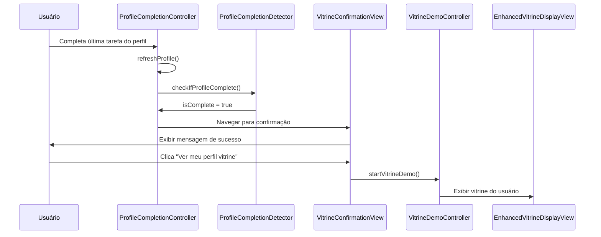

# Design Document

## Overview

Este documento descreve o design para implementar o redirecionamento automático para a vitrine de propósito quando um usuário completa seu perfil espiritual. O sistema deve detectar quando o perfil está 100% completo e oferecer uma experiência fluida para visualizar o resultado.

## Architecture

### Componentes Principais

1. **ProfileCompletionController** - Controlador principal que gerencia o estado do perfil
2. **VitrineConfirmationView** - Nova tela de confirmação após completar o perfil
3. **VitrineNavigationHelper** - Utilitário para navegação entre perfil e vitrine
4. **ProfileCompletionDetector** - Serviço para detectar quando o perfil está completo

### Fluxo de Dados



## Components and Interfaces

### 1. VitrineConfirmationView

Nova tela que será exibida quando o perfil for completado com sucesso.

**Responsabilidades:**
- Exibir mensagem de parabéns
- Mostrar botão para visualizar vitrine
- Permitir navegação alternativa
- Tratar erros de carregamento da vitrine

**Interface:**
```dart
class VitrineConfirmationView extends StatelessWidget {
  final String userId;
  final VoidCallback? onContinue;
  final VoidCallback? onSkip;
  
  const VitrineConfirmationView({
    Key? key,
    required this.userId,
    this.onContinue,
    this.onSkip,
  }) : super(key: key);
}
```

### 2. VitrineNavigationHelper

Utilitário para centralizar a lógica de navegação entre perfil e vitrine.

**Responsabilidades:**
- Validar se o perfil está completo antes de mostrar vitrine
- Gerenciar transições entre telas
- Tratar erros de navegação
- Manter histórico de navegação

**Interface:**
```dart
class VitrineNavigationHelper {
  static Future<bool> canShowVitrine(String userId);
  static Future<void> navigateToVitrineConfirmation(String userId);
  static Future<void> navigateToVitrineDisplay(String userId);
  static Future<void> handleNavigationError(String error);
}
```

### 3. ProfileCompletionDetector

Serviço para detectar quando o perfil está completo e acionar ações apropriadas.

**Responsabilidades:**
- Monitorar mudanças no estado do perfil
- Detectar quando perfil atinge 100% de completude
- Acionar callbacks quando perfil é completado
- Validar integridade dos dados do perfil

**Interface:**
```dart
class ProfileCompletionDetector {
  static Future<bool> isProfileComplete(String userId);
  static Stream<bool> watchProfileCompletion(String userId);
  static Future<void> onProfileCompleted(String userId, VoidCallback callback);
  static Future<ProfileCompletionStatus> getCompletionStatus(String userId);
}
```

### 4. Modificações no ProfileCompletionController

**Novos métodos:**
```dart
class ProfileCompletionController extends GetxController {
  // Método existente modificado
  Future<void> refreshProfile() async {
    await loadProfile();
    await _checkAndHandleProfileCompletion();
  }
  
  // Novos métodos
  Future<void> _checkAndHandleProfileCompletion() async;
  Future<void> _navigateToVitrineConfirmation() async;
  void _handleVitrineNavigationError(String error);
}
```

## Data Models

### ProfileCompletionStatus

```dart
class ProfileCompletionStatus {
  final bool isComplete;
  final double completionPercentage;
  final List<String> missingTasks;
  final DateTime? completedAt;
  final bool hasBeenShown; // Flag para evitar mostrar múltiplas vezes
  
  const ProfileCompletionStatus({
    required this.isComplete,
    required this.completionPercentage,
    required this.missingTasks,
    this.completedAt,
    this.hasBeenShown = false,
  });
}
```

### VitrineConfirmationData

```dart
class VitrineConfirmationData {
  final String userId;
  final String userName;
  final String? userPhoto;
  final DateTime completedAt;
  final bool canShowVitrine;
  
  const VitrineConfirmationData({
    required this.userId,
    required this.userName,
    this.userPhoto,
    required this.completedAt,
    required this.canShowVitrine,
  });
}
```

## Error Handling

### Tipos de Erro

1. **ProfileNotCompleteError** - Perfil não está realmente completo
2. **VitrineLoadError** - Erro ao carregar dados da vitrine
3. **NavigationError** - Erro na navegação entre telas
4. **DataSyncError** - Erro na sincronização de dados

### Estratégias de Tratamento

```dart
class VitrineErrorHandler {
  static void handleProfileNotComplete() {
    // Mostrar mensagem explicativa e voltar para completion
  }
  
  static void handleVitrineLoadError() {
    // Oferecer opção de tentar novamente ou continuar depois
  }
  
  static void handleNavigationError() {
    // Voltar para tela anterior com mensagem de erro
  }
  
  static void handleDataSyncError() {
    // Tentar sincronizar novamente ou mostrar dados em cache
  }
}
```

## Testing Strategy

### Testes Unitários

1. **ProfileCompletionDetector**
   - Teste de detecção correta de perfil completo
   - Teste de perfil incompleto
   - Teste de dados inválidos

2. **VitrineNavigationHelper**
   - Teste de navegação bem-sucedida
   - Teste de tratamento de erros
   - Teste de validações

3. **ProfileCompletionController**
   - Teste do fluxo completo de completion
   - Teste de refresh após completar tarefa
   - Teste de tratamento de erros

### Testes de Integração

1. **Fluxo Completo**
   - Usuário completa última tarefa → vê confirmação → visualiza vitrine
   - Teste com diferentes estados de perfil
   - Teste com erros de rede

2. **Navegação**
   - Teste de transições entre telas
   - Teste de volta/cancelamento
   - Teste de deep links

### Testes de UI

1. **VitrineConfirmationView**
   - Teste de renderização correta
   - Teste de interações do usuário
   - Teste de estados de loading/erro

2. **Integração com outras telas**
   - Teste de navegação a partir de ProfileCompletionView
   - Teste de volta para telas anteriores

## Implementation Notes

### Detecção de Perfil Completo

O sistema deve verificar:
1. Todas as tarefas obrigatórias estão marcadas como completas
2. Dados essenciais estão preenchidos (foto, nome, biografia, etc.)
3. Perfil passou por validação de integridade
4. Usuário não viu a confirmação ainda (evitar spam)

### Persistência de Estado

- Salvar flag `hasSeenVitrineConfirmation` no perfil do usuário
- Usar SharedPreferences para cache local
- Sincronizar com Firestore para persistência

### Performance

- Carregar dados da vitrine em background durante confirmação
- Usar cache para evitar recarregamentos desnecessários
- Implementar loading states apropriados

### Acessibilidade

- Adicionar labels apropriados para screen readers
- Garantir contraste adequado nas cores
- Implementar navegação por teclado

### Internacionalização

- Todas as strings devem ser externalizadas
- Suporte para diferentes idiomas
- Formatação de datas/números por localização

## Security Considerations

1. **Validação de Dados**
   - Validar se usuário tem permissão para ver vitrine
   - Verificar integridade dos dados do perfil
   - Sanitizar dados antes de exibir

2. **Privacidade**
   - Respeitar configurações de privacidade do usuário
   - Não expor dados sensíveis em logs
   - Implementar controles de visibilidade

3. **Autenticação**
   - Verificar se usuário está autenticado
   - Validar tokens de sessão
   - Implementar timeout apropriado

## Monitoring and Analytics

### Métricas a Coletar

1. **Completion Rate**
   - Quantos usuários completam o perfil
   - Tempo médio para completar
   - Tarefas que mais causam abandono

2. **Vitrine Engagement**
   - Quantos usuários visualizam a vitrine após completar
   - Tempo gasto na vitrine
   - Ações realizadas (compartilhar, editar, etc.)

3. **Error Rates**
   - Frequência de erros de navegação
   - Tipos de erro mais comuns
   - Taxa de recuperação de erros

### Logging

```dart
class VitrineAnalytics {
  static void trackProfileCompleted(String userId);
  static void trackVitrineConfirmationShown(String userId);
  static void trackVitrineViewed(String userId);
  static void trackNavigationError(String error, String context);
}
```