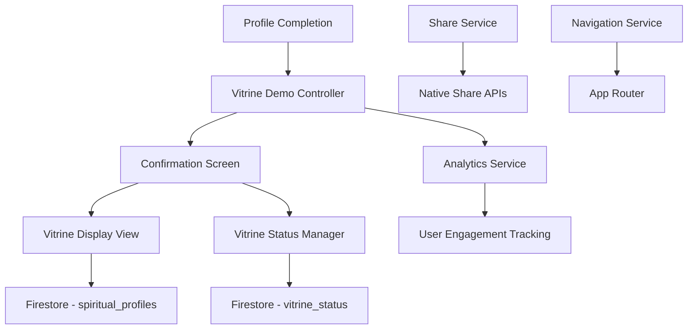

# Design Document

## Overview

Este documento descreve o design para criar uma experiência de demonstração imediata da vitrine de propósito após o usuário completar seu cadastro. O design foca em criar uma interface celebrativa, intuitiva e funcional que permita ao usuário visualizar, gerenciar e compartilhar sua vitrine pública.

## Architecture

### Component Architecture



### Data Flow

1. **Profile Completion** → Trigger demo experience
2. **Confirmation Screen** → Show celebration and options
3. **Vitrine Display** → Render public view of profile
4. **Status Management** → Handle activation/deactivation
5. **Share Integration** → Generate and share public links

## Components and Interfaces

### 1. Vitrine Demo Controller

**Responsabilidades:**
- Coordenar a experiência de demonstração
- Gerenciar estado da vitrine (ativa/inativa)
- Controlar navegação entre telas
- Integrar com serviços de compartilhamento

**Interface:**
```dart
class VitrineDemoController extends GetxController {
  // Estado da vitrine
  final RxBool isVitrineActive = true.obs;
  final RxBool isLoading = false.obs;
  final Rx<VitrineStatus> vitrineStatus = VitrineStatus.active.obs;
  
  // Métodos principais
  Future<void> showDemoExperience(String userId);
  Future<void> toggleVitrineStatus();
  Future<void> navigateToVitrineView();
  Future<String> generateShareLink();
  
  // Métodos de controle
  void trackDemoEngagement(String action);
  Future<void> updateVitrineVisibility(bool isVisible);
}
```

### 2. Vitrine Confirmation Screen

**Responsabilidades:**
- Exibir mensagem celebrativa
- Mostrar botões de ação principais
- Indicar status atual da vitrine
- Fornecer opções de navegação

**Interface Components:**
```dart
class VitrineConfirmationScreen extends StatelessWidget {
  // Header celebrativo
  Widget _buildCelebrationHeader()
  
  // Mensagem principal
  Widget _buildConfirmationMessage()
  
  // Botão principal - Ver vitrine
  Widget _buildViewVitrineButton()
  
  // Botão secundário - Desativar
  Widget _buildToggleStatusButton()
  
  // Indicador de status
  Widget _buildStatusIndicator()
  
  // Opções adicionais
  Widget _buildAdditionalOptions()
}
```

### 3. Enhanced Vitrine Display View

**Responsabilidades:**
- Renderizar vitrine como vista pública
- Mostrar indicadores de visualização própria
- Integrar opções de compartilhamento
- Gerenciar carregamento e erros

**Interface:**
```dart
class EnhancedVitrineDisplayView extends StatelessWidget {
  final String userId;
  final bool isOwnProfile;
  
  // Header com foto e informações básicas
  Widget _buildVitrineHeader()
  
  // Seção de biografia e propósito
  Widget _buildPurposeSection()
  
  // Galeria de fotos
  Widget _buildPhotoGallery()
  
  // Informações de contato/interesse
  Widget _buildContactSection()
  
  // Barra de ações (compartilhar, editar)
  Widget _buildActionBar()
  
  // Indicador de visualização própria
  Widget _buildOwnProfileIndicator()
}
```

### 4. Vitrine Status Manager

**Responsabilidades:**
- Gerenciar visibilidade pública da vitrine
- Sincronizar status entre collections
- Manter histórico de mudanças
- Notificar mudanças de status

**Interface:**
```dart
class VitrineStatusManager {
  // Gerenciamento de status
  Future<VitrineStatus> getVitrineStatus(String userId);
  Future<void> setVitrineStatus(String userId, VitrineStatus status);
  Stream<VitrineStatus> watchVitrineStatus(String userId);
  
  // Validações
  Future<bool> canActivateVitrine(String userId);
  Future<List<String>> getMissingRequiredFields(String userId);
  
  // Histórico
  Future<void> logStatusChange(String userId, VitrineStatus oldStatus, VitrineStatus newStatus);
}
```

### 5. Share Service Integration

**Responsabilidades:**
- Gerar links públicos da vitrine
- Integrar com APIs nativas de compartilhamento
- Gerenciar diferentes tipos de compartilhamento
- Rastrear compartilhamentos

**Interface:**
```dart
class VitrineShareService {
  // Geração de links
  Future<String> generatePublicLink(String userId);
  Future<String> generateShareableContent(String userId);
  
  // Compartilhamento
  Future<void> shareVitrine(String userId, ShareType type);
  Future<void> copyLinkToClipboard(String link);
  
  // Analytics
  void trackShareAction(String userId, ShareType type);
}
```

## Data Models

### Vitrine Status Model

```dart
enum VitrineStatus {
  active,
  inactive,
  pending,
  suspended
}

class VitrineStatusInfo {
  String userId;
  VitrineStatus status;
  DateTime lastUpdated;
  String? reason;
  Map<String, dynamic>? metadata;
  
  // Métodos de conversão
  Map<String, dynamic> toFirestore();
  static VitrineStatusInfo fromFirestore(Map<String, dynamic> data);
  
  // Validações
  bool get isPubliclyVisible => status == VitrineStatus.active;
  bool get canBeShared => status == VitrineStatus.active;
}
```

### Demo Experience Model

```dart
class DemoExperienceData {
  String userId;
  DateTime completionTime;
  bool hasViewedVitrine;
  bool hasSharedVitrine;
  int viewCount;
  List<String> actionsPerformed;
  
  // Analytics
  Duration timeToFirstView;
  String? shareMethod;
  Map<String, dynamic> engagementMetrics;
}
```

### Share Configuration Model

```dart
enum ShareType {
  link,
  whatsapp,
  instagram,
  facebook,
  email,
  sms
}

class ShareConfiguration {
  String title;
  String description;
  String? imageUrl;
  String deepLink;
  Map<String, String> platformSpecificData;
  
  // Métodos de geração
  String generateShareText(ShareType type);
  Map<String, dynamic> getPlatformData(ShareType type);
}
```

## User Interface Design

### 1. Confirmation Screen Layout

```dart
class ConfirmationScreenLayout {
  // Layout principal
  Widget build() {
    return Scaffold(
      backgroundColor: AppColors.celebrationBackground,
      body: SafeArea(
        child: Column(
          children: [
            _buildCelebrationHeader(),
            _buildMainContent(),
            _buildActionButtons(),
            _buildAdditionalOptions(),
          ],
        ),
      ),
    );
  }
  
  // Header com animação celebrativa
  Widget _buildCelebrationHeader() {
    return Container(
      padding: EdgeInsets.all(24),
      child: Column(
        children: [
          // Ícone animado de sucesso
          AnimatedContainer(
            duration: Duration(milliseconds: 800),
            child: Icon(
              Icons.celebration,
              size: 80,
              color: AppColors.success,
            ),
          ),
          SizedBox(height: 16),
          // Título principal
          Text(
            'Parabéns!',
            style: AppTextStyles.celebrationTitle,
          ),
        ],
      ),
    );
  }
  
  // Conteúdo principal
  Widget _buildMainContent() {
    return Expanded(
      child: Padding(
        padding: EdgeInsets.symmetric(horizontal: 24),
        child: Column(
          mainAxisAlignment: MainAxisAlignment.center,
          children: [
            // Mensagem principal
            Text(
              'Sua vitrine de propósito está pronta para receber visitas, confira!',
              style: AppTextStyles.confirmationMessage,
              textAlign: TextAlign.center,
            ),
            SizedBox(height: 32),
            // Preview da vitrine
            _buildVitrinePreview(),
          ],
        ),
      ),
    );
  }
  
  // Botões de ação
  Widget _buildActionButtons() {
    return Padding(
      padding: EdgeInsets.all(24),
      child: Column(
        children: [
          // Botão principal
          SizedBox(
            width: double.infinity,
            height: 56,
            child: ElevatedButton.icon(
              onPressed: () => controller.navigateToVitrineView(),
              icon: Icon(Icons.visibility),
              label: Text('Ver minha vitrine de propósito'),
              style: AppButtonStyles.primary,
            ),
          ),
          SizedBox(height: 16),
          // Botão secundário
          SizedBox(
            width: double.infinity,
            height: 48,
            child: OutlinedButton.icon(
              onPressed: () => _showDeactivationDialog(),
              icon: Icon(Icons.visibility_off),
              label: Text('Desativar vitrine de propósito'),
              style: AppButtonStyles.secondary,
            ),
          ),
        ],
      ),
    );
  }
}
```

### 2. Vitrine Display Enhancements

```dart
class EnhancedVitrineDisplay {
  // Indicador de visualização própria
  Widget _buildOwnProfileBanner() {
    return Container(
      width: double.infinity,
      padding: EdgeInsets.all(12),
      decoration: BoxDecoration(
        color: AppColors.info.withOpacity(0.1),
        border: Border(
          bottom: BorderSide(color: AppColors.info, width: 2),
        ),
      ),
      child: Row(
        children: [
          Icon(Icons.preview, color: AppColors.info),
          SizedBox(width: 8),
          Text(
            'Você está visualizando sua vitrine como outros a verão',
            style: AppTextStyles.infoText,
          ),
        ],
      ),
    );
  }
  
  // Barra de ações aprimorada
  Widget _buildEnhancedActionBar() {
    return Container(
      padding: EdgeInsets.all(16),
      decoration: BoxDecoration(
        color: Colors.white,
        boxShadow: [AppShadows.subtle],
      ),
      child: Row(
        children: [
          // Status indicator
          _buildStatusChip(),
          Spacer(),
          // Share button
          IconButton(
            onPressed: () => _showShareOptions(),
            icon: Icon(Icons.share),
            tooltip: 'Compartilhar vitrine',
          ),
          // Edit button
          IconButton(
            onPressed: () => _navigateToEdit(),
            icon: Icon(Icons.edit),
            tooltip: 'Editar vitrine',
          ),
        ],
      ),
    );
  }
  
  // Chip de status
  Widget _buildStatusChip() {
    return Obx(() {
      final isActive = controller.isVitrineActive.value;
      return Chip(
        avatar: Icon(
          isActive ? Icons.public : Icons.public_off,
          size: 16,
          color: isActive ? AppColors.success : AppColors.inactive,
        ),
        label: Text(
          isActive ? 'Pública' : 'Privada',
          style: TextStyle(
            color: isActive ? AppColors.success : AppColors.inactive,
            fontWeight: FontWeight.w600,
          ),
        ),
        backgroundColor: isActive 
          ? AppColors.success.withOpacity(0.1)
          : AppColors.inactive.withOpacity(0.1),
      );
    });
  }
}
```

## Error Handling & Edge Cases

### 1. Incomplete Profile Handling

```dart
class IncompleteProfileHandler {
  static Widget buildMissingFieldsIndicator(List<String> missingFields) {
    return Container(
      margin: EdgeInsets.all(16),
      padding: EdgeInsets.all(16),
      decoration: BoxDecoration(
        color: AppColors.warning.withOpacity(0.1),
        borderRadius: BorderRadius.circular(8),
        border: Border.all(color: AppColors.warning),
      ),
      child: Column(
        crossAxisAlignment: CrossAxisAlignment.start,
        children: [
          Row(
            children: [
              Icon(Icons.warning, color: AppColors.warning),
              SizedBox(width: 8),
              Text(
                'Perfil incompleto',
                style: AppTextStyles.warningTitle,
              ),
            ],
          ),
          SizedBox(height: 8),
          Text(
            'Complete os campos abaixo para melhorar sua vitrine:',
            style: AppTextStyles.warningText,
          ),
          SizedBox(height: 8),
          ...missingFields.map((field) => 
            Padding(
              padding: EdgeInsets.only(left: 16, top: 4),
              child: Row(
                children: [
                  Icon(Icons.circle, size: 6, color: AppColors.warning),
                  SizedBox(width: 8),
                  Text(field, style: AppTextStyles.bodyText),
                ],
              ),
            ),
          ),
        ],
      ),
    );
  }
}
```

### 2. Network Error Handling

```dart
class NetworkErrorHandler {
  static Widget buildRetryWidget(VoidCallback onRetry) {
    return Center(
      child: Column(
        mainAxisAlignment: MainAxisAlignment.center,
        children: [
          Icon(
            Icons.cloud_off,
            size: 64,
            color: AppColors.inactive,
          ),
          SizedBox(height: 16),
          Text(
            'Erro de conexão',
            style: AppTextStyles.errorTitle,
          ),
          SizedBox(height: 8),
          Text(
            'Verifique sua conexão e tente novamente',
            style: AppTextStyles.errorText,
            textAlign: TextAlign.center,
          ),
          SizedBox(height: 24),
          ElevatedButton.icon(
            onPressed: onRetry,
            icon: Icon(Icons.refresh),
            label: Text('Tentar novamente'),
            style: AppButtonStyles.primary,
          ),
        ],
      ),
    );
  }
}
```

## Analytics & Tracking

### Demo Experience Analytics

```dart
class DemoAnalytics {
  static void trackDemoStart(String userId) {
    AnalyticsService.track('vitrine_demo_started', {
      'user_id': userId,
      'timestamp': DateTime.now().toIso8601String(),
    });
  }
  
  static void trackVitrineView(String userId, Duration timeToView) {
    AnalyticsService.track('vitrine_first_view', {
      'user_id': userId,
      'time_to_view_seconds': timeToView.inSeconds,
      'timestamp': DateTime.now().toIso8601String(),
    });
  }
  
  static void trackStatusToggle(String userId, bool newStatus) {
    AnalyticsService.track('vitrine_status_toggle', {
      'user_id': userId,
      'new_status': newStatus ? 'active' : 'inactive',
      'timestamp': DateTime.now().toIso8601String(),
    });
  }
  
  static void trackShare(String userId, ShareType shareType) {
    AnalyticsService.track('vitrine_shared', {
      'user_id': userId,
      'share_type': shareType.toString(),
      'timestamp': DateTime.now().toIso8601String(),
    });
  }
}
```

## Testing Strategy

### Unit Tests

1. **Controller Tests**
   - Teste de mudança de status da vitrine
   - Teste de geração de links de compartilhamento
   - Teste de navegação entre telas

2. **Service Tests**
   - Teste de VitrineStatusManager
   - Teste de VitrineShareService
   - Teste de validações de perfil

### Widget Tests

1. **Confirmation Screen Tests**
   - Teste de renderização de elementos
   - Teste de interações com botões
   - Teste de estados de carregamento

2. **Vitrine Display Tests**
   - Teste de exibição de dados
   - Teste de indicadores de status
   - Teste de tratamento de erros

### Integration Tests

1. **End-to-End Demo Flow**
   - Teste completo do fluxo de demonstração
   - Teste de navegação entre telas
   - Teste de persistência de status

2. **Share Integration Tests**
   - Teste de geração de links
   - Teste de compartilhamento nativo
   - Teste de analytics de compartilhamento

## Performance Considerations

### 1. Lazy Loading

```dart
class LazyVitrineLoader {
  static Widget buildLazyVitrinePreview() {
    return FutureBuilder<SpiritualProfileModel>(
      future: _loadVitrineData(),
      builder: (context, snapshot) {
        if (snapshot.connectionState == ConnectionState.waiting) {
          return _buildSkeletonLoader();
        }
        
        if (snapshot.hasError) {
          return _buildErrorWidget();
        }
        
        return _buildVitrinePreview(snapshot.data!);
      },
    );
  }
}
```

### 2. Image Optimization

```dart
class OptimizedVitrineImages {
  static Widget buildOptimizedImage(String? imageUrl) {
    return CachedNetworkImage(
      imageUrl: imageUrl ?? '',
      placeholder: (context, url) => ShimmerPlaceholder(),
      errorWidget: (context, url, error) => DefaultAvatar(),
      memCacheWidth: 300,
      memCacheHeight: 300,
      fadeInDuration: Duration(milliseconds: 300),
    );
  }
}
```

## Security Considerations

### 1. Link Generation Security

```dart
class SecureShareLinks {
  static Future<String> generateSecureLink(String userId) {
    // Gerar token temporário para acesso público
    final token = _generateAccessToken(userId);
    
    // Criar link com expiração
    final expirationTime = DateTime.now().add(Duration(days: 30));
    
    return 'https://app.kiro.com/vitrine/$userId?token=$token&expires=${expirationTime.millisecondsSinceEpoch}';
  }
  
  static bool validateAccessToken(String userId, String token) {
    // Validar token e expiração
    return _isValidToken(userId, token) && !_isExpired(token);
  }
}
```

### 2. Privacy Controls

```dart
class PrivacyManager {
  static Future<bool> canViewVitrine(String targetUserId, String? viewerUserId) {
    // Verificar se a vitrine está ativa
    // Verificar configurações de privacidade
    // Aplicar regras de visibilidade
    return _checkVisibilityRules(targetUserId, viewerUserId);
  }
}
```