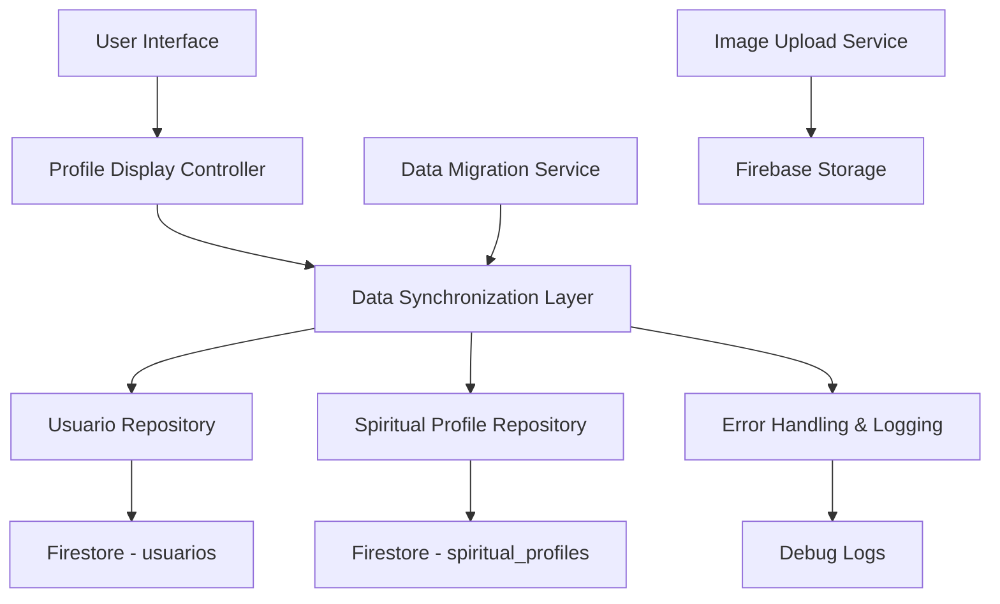

# Design Document

## Overview

Este documento descreve o design para integrar e melhorar o sistema de "Vitrine de Propósito", consolidando funcionalidades de username e foto de perfil em uma experiência unificada. O design foca em resolver problemas de sincronização de dados, erros de tipo, e criar uma interface mais intuitiva para gerenciamento de perfil.

## Architecture

### Data Flow Architecture



### Component Integration

1. **Profile Display Controller**: Controlador principal que gerencia estado e coordena operações
2. **Data Synchronization Layer**: Camada responsável por manter dados sincronizados entre collections
3. **Data Migration Service**: Serviço que corrige automaticamente tipos de dados incorretos
4. **Image Upload Service**: Serviço especializado em upload e gerenciamento de imagens
5. **Error Handling & Logging**: Sistema robusto de tratamento de erros e logging

## Components and Interfaces

### 1. Enhanced Profile Display View

**Responsabilidades:**
- Exibir informações consolidadas do perfil
- Permitir edição inline de username
- Gerenciar upload de foto de perfil
- Mostrar status de sincronização

**Interface Components:**
```dart
class EnhancedProfileDisplayView {
  // Header com foto editável
  Widget _buildEditableProfileHeader()
  
  // Username editável inline
  Widget _buildEditableUsername()
  
  // Indicador de sincronização
  Widget _buildSyncStatusIndicator()
  
  // Seção de informações consolidadas
  Widget _buildConsolidatedInfoSection()
}
```

### 2. Profile Data Synchronizer

**Responsabilidades:**
- Sincronizar dados entre usuarios e spiritual_profiles
- Detectar e resolver conflitos de dados
- Executar migrações automáticas

**Interface:**
```dart
class ProfileDataSynchronizer {
  Future<void> syncUserData(String userId)
  Future<void> resolveDataConflicts(String userId)
  Future<bool> migrateCorruptedData(String profileId, Map<String, dynamic> data)
  Stream<SyncStatus> getSyncStatus(String userId)
}
```

### 3. Enhanced Image Manager

**Responsabilidades:**
- Upload robusto de imagens
- Gerenciamento de cache
- Fallback para imagens padrão
- Geração de avatars com iniciais

**Interface:**
```dart
class EnhancedImageManager {
  Future<String> uploadProfileImage(Uint8List imageData, String userId)
  Widget buildRobustImage(String? imageUrl, String fallbackText)
  Widget buildInitialsAvatar(String name)
  Future<void> clearImageCache(String imageUrl)
}
```

### 4. Username Management Service

**Responsabilidades:**
- Validação de username
- Verificação de unicidade
- Sincronização entre collections

**Interface:**
```dart
class UsernameManagementService {
  Future<bool> isUsernameAvailable(String username)
  Future<void> updateUsername(String userId, String newUsername)
  Future<String?> generateSuggestions(String baseName)
  Future<void> syncUsernameAcrossCollections(String userId, String username)
}
```

## Data Models

### Enhanced Usuario Model

```dart
class UsuarioModel {
  String? id;
  String nome;
  String? username;
  String email;
  String? imgUrl;
  String? imgBgUrl;
  UserSexo sexo;
  bool perfilIsComplete;
  bool? isAdmin;
  DateTime? lastSyncAt;  // Novo campo para controle de sincronização
  
  // Métodos de sincronização
  Map<String, dynamic> toSyncData();
  static UsuarioModel fromSyncData(Map<String, dynamic> data);
}
```

### Enhanced Spiritual Profile Model

```dart
class SpiritualProfileModel {
  String? id;
  String userId;
  String? displayName;    // Sincronizado com usuario.nome
  String? username;       // Sincronizado com usuario.username
  String? profileImageUrl; // Sincronizado com usuario.imgUrl
  DateTime? lastSyncAt;   // Novo campo para controle de sincronização
  
  // Campos existentes...
  
  // Métodos de sincronização
  Map<String, dynamic> toSyncData();
  static SpiritualProfileModel fromSyncData(Map<String, dynamic> data);
  bool needsSync(UsuarioModel user);
}
```

### Sync Status Model

```dart
enum SyncStatus {
  synced,
  syncing,
  conflicted,
  failed
}

class ProfileSyncInfo {
  String userId;
  SyncStatus status;
  DateTime lastSyncAt;
  List<String> conflictedFields;
  String? errorMessage;
}
```

## Error Handling

### Data Type Migration Strategy

```dart
class DataTypeMigrator {
  static Future<Map<String, dynamic>> migrateProfileData(
    String profileId, 
    Map<String, dynamic> rawData
  ) {
    // 1. Identificar campos com tipos incorretos
    // 2. Converter Timestamp para bool quando necessário
    // 3. Aplicar valores padrão para dados corrompidos
    // 4. Atualizar no Firestore
    // 5. Registrar migração nos logs
  }
}
```

### Robust Image Loading

```dart
class RobustImageWidget extends StatelessWidget {
  final String? imageUrl;
  final String fallbackText;
  final double size;
  
  @override
  Widget build(BuildContext context) {
    return CachedNetworkImage(
      imageUrl: imageUrl ?? '',
      placeholder: (context, url) => _buildLoadingPlaceholder(),
      errorWidget: (context, url, error) => _buildInitialsAvatar(),
      fadeInDuration: Duration(milliseconds: 300),
      memCacheWidth: 300,
      memCacheHeight: 300,
    );
  }
}
```

## Testing Strategy

### Unit Tests

1. **Data Synchronization Tests**
   - Teste de sincronização entre collections
   - Teste de resolução de conflitos
   - Teste de migração de tipos de dados

2. **Username Management Tests**
   - Teste de validação de username
   - Teste de verificação de unicidade
   - Teste de sincronização de username

3. **Image Management Tests**
   - Teste de upload de imagens
   - Teste de fallback para imagens padrão
   - Teste de geração de avatars

### Integration Tests

1. **End-to-End Profile Management**
   - Teste completo de criação/edição de perfil
   - Teste de sincronização em tempo real
   - Teste de recuperação de erros

2. **Data Migration Tests**
   - Teste de migração de dados antigos
   - Teste de correção de tipos incorretos
   - Teste de preservação de dados durante migração

### Performance Tests

1. **Image Loading Performance**
   - Teste de carregamento de múltiplas imagens
   - Teste de cache de imagens
   - Teste de fallback performance

2. **Data Sync Performance**
   - Teste de sincronização com grandes volumes de dados
   - Teste de performance de queries
   - Teste de otimização de network calls

## Security Considerations

### Data Validation

1. **Username Validation**
   - Sanitização de input
   - Prevenção de caracteres maliciosos
   - Validação de comprimento e formato

2. **Image Upload Security**
   - Validação de tipo de arquivo
   - Limitação de tamanho
   - Sanitização de metadados

### Privacy Protection

1. **Data Synchronization**
   - Criptografia de dados sensíveis
   - Controle de acesso baseado em permissões
   - Auditoria de mudanças de dados

## Implementation Phases

### Phase 1: Data Migration & Error Fixing
- Implementar sistema de migração automática
- Corrigir erros de tipo Timestamp vs Bool
- Adicionar logging robusto

### Phase 2: Username Integration
- Integrar edição de username na Vitrine de Propósito
- Implementar validação e sincronização
- Adicionar sugestões de username

### Phase 3: Image Management Enhancement
- Melhorar sistema de upload de imagens
- Implementar fallbacks robustos
- Adicionar geração de avatars

### Phase 4: Real-time Synchronization
- Implementar sincronização em tempo real
- Adicionar indicadores de status
- Otimizar performance de sync

### Phase 5: Testing & Polish
- Testes abrangentes
- Otimizações de performance
- Refinamentos de UX