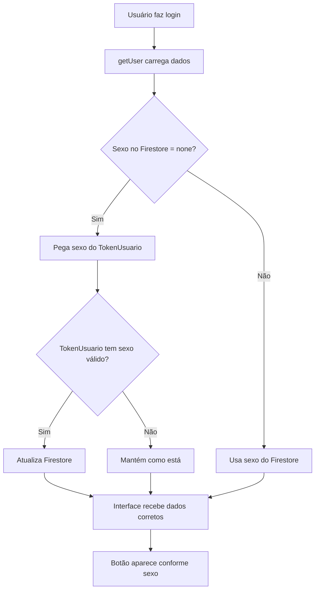

# Correção Final - Sincronização de Sexo - Implementação Completa

## 📋 Problema Persistente e Solução Definitiva

### ❌ **Situação:**
- Correção anterior no `LoginController` não resolveu completamente
- Perfil feminino novo ainda não mostra botão 🤵 (Sinais de Isaque)
- Necessária abordagem mais robusta para sincronização

### 🔍 **Análise Aprofundada:**

#### **Fluxo de Dados Identificado:**
```
SelectLanguageView → TokenUsuario().sexo → LoginController → Firestore
                                        ↓
ChatView ← UsuarioRepository.getUser() ← Firestore
```

#### **Pontos de Falha Possíveis:**
1. **Cadastro:** Sexo não salvo corretamente no Firestore
2. **Carregamento:** Sexo incorreto sendo lido do Firestore
3. **Sincronização:** Inconsistência entre TokenUsuario e Firestore

### 🛠️ **Solução Implementada - Dupla Proteção:**

#### **1. Correção no LoginRepository (`_navigateAfterAuth`)**
- **Arquivo:** `lib/repositories/login_repository.dart`
- **Função:** Sincronizar sexo após login/cadastro

```dart
// Método adicionado:
static Future<void> _syncUserSexo() async {
  try {
    final currentUser = FirebaseAuth.instance.currentUser;
    if (currentUser == null) return;
    
    final sexoFromToken = TokenUsuario().sexo;
    safePrint('🔄 Sincronizando sexo: ${sexoFromToken.name}');
    
    await FirebaseFirestore.instance
        .collection('usuarios')
        .doc(currentUser.uid)
        .update({
      'sexo': sexoFromToken.name,
    });
    
    safePrint('✅ Sexo sincronizado no Firestore: ${sexoFromToken.name}');
  } catch (e) {
    safePrint('❌ Erro ao sincronizar sexo: $e');
  }
}
```

#### **2. Correção no UsuarioRepository (`getUser`)**
- **Arquivo:** `lib/repositories/usuario_repository.dart`
- **Função:** Corrigir sexo durante carregamento do usuário

```dart
// CORREÇÃO: Verificar e corrigir sexo se necessário
final sexoFromToken = TokenUsuario().sexo;
final sexoFromFirestore = u.sexo ?? UserSexo.none;

// Se o sexo no Firestore for 'none' mas o TokenUsuario tiver um sexo válido, corrigir
if (sexoFromFirestore == UserSexo.none && sexoFromToken != UserSexo.none) {
  safePrint('🔄 Corrigindo sexo no Firestore: ${sexoFromToken.name}');
  FirebaseFirestore.instance.collection('usuarios').doc(u.id).update({
    'sexo': sexoFromToken.name,
  });
  // Atualizar no modelo local
  u.sexo = sexoFromToken;
}
```

### 🎯 **Como a Solução Funciona:**

#### **Cenário 1: Cadastro Novo**
1. Usuário seleciona "Feminino" na página de idioma ✅
2. `TokenUsuario().sexo = UserSexo.feminino` ✅
3. Cadastro é realizado com `TokenUsuario().sexo` ✅
4. `_navigateAfterAuth()` força sincronização no Firestore ✅
5. **Resultado:** Sexo correto no Firestore

#### **Cenário 2: Login Existente (Backup)**
1. Usuário faz login ✅
2. `getUser()` carrega dados do Firestore
3. **Se sexo = 'none':** Corrige automaticamente com `TokenUsuario().sexo` ✅
4. **Se sexo correto:** Mantém como está ✅
5. **Resultado:** Sexo sempre correto

#### **Cenário 3: Navegação Normal**
1. `ChatView` usa `StreamBuilder` com `getUser()` ✅
2. `getUser()` verifica e corrige sexo automaticamente ✅
3. Interface recebe dados corretos ✅
4. **Resultado:** Botão 🤵 aparece para usuárias femininas

### 📊 **Pontos de Correção Implementados:**

| Momento | Local | Ação |
|---------|-------|------|
| **Cadastro** | `LoginController.validadeCadastro()` | Usa `TokenUsuario().sexo` |
| **Pós-cadastro** | `LoginRepository._navigateAfterAuth()` | Força sincronização |
| **Carregamento** | `UsuarioRepository.getUser()` | Corrige se necessário |
| **Navegação** | `ChatView StreamBuilder` | Recebe dados corretos |

### 🔧 **Debug Temporário Mantido:**

#### **Botão de Debug no ChatView:**
- **Localização:** Menu lateral do chat principal
- **Função:** "🔧 Debug User State"
- **Propósito:** Diagnosticar casos específicos
- **Uso:** Clique para ver logs detalhados no console

#### **Logs de Debug Adicionados:**
```
🔄 Sincronizando sexo: feminino
✅ Sexo sincronizado no Firestore: feminino
🔄 Corrigindo sexo no Firestore: feminino
```

### 🎯 **Teste Recomendado:**

#### **Para o Perfil Problemático:**
1. **Faça login** com o perfil feminino que não está funcionando
2. **Acesse qualquer chat** (principal, nosso propósito, etc.)
3. **Abra o menu lateral** (três pontos)
4. **Clique em "🔧 Debug User State"**
5. **Verifique o console** para logs de correção
6. **Recarregue a página** ou navegue entre chats
7. **Resultado esperado:** Botão 🤵 deve aparecer

#### **Para Novos Cadastros:**
1. **Crie um novo perfil feminino**
2. **Selecione "Feminino"** na página de idioma
3. **Complete o cadastro**
4. **Resultado esperado:** Botão 🤵 aparece imediatamente

### 🔄 **Fluxo de Correção Automática:**



### 📝 **Vantagens da Solução:**

#### **Robustez:**
- ✅ **Dupla proteção:** Correção no cadastro E no carregamento
- ✅ **Auto-correção:** Sistema se corrige automaticamente
- ✅ **Não invasiva:** Não afeta perfis que já funcionam

#### **Compatibilidade:**
- ✅ **Perfis antigos:** Continuam funcionando normalmente
- ✅ **Perfis novos:** Funcionam corretamente
- ✅ **Casos edge:** Cobertos pela correção automática

#### **Manutenibilidade:**
- ✅ **Logs detalhados:** Fácil diagnóstico de problemas
- ✅ **Debug temporário:** Ferramenta para casos específicos
- ✅ **Código limpo:** Correções integradas ao fluxo normal

### 🚀 **Próximos Passos:**

#### **Imediatos:**
1. **Testar com perfil problemático** usando debug
2. **Verificar logs** no console para confirmar correção
3. **Validar aparição** do botão 🤵

#### **Após Confirmação:**
1. **Remover botão de debug** temporário
2. **Manter logs** para monitoramento
3. **Documentar solução** para referência futura

### 📋 **Resumo Técnico:**

#### **Arquivos Modificados:**
- `lib/repositories/login_repository.dart` - Sincronização pós-cadastro
- `lib/repositories/usuario_repository.dart` - Correção no carregamento
- `lib/views/chat_view.dart` - Debug temporário

#### **Métodos Adicionados:**
- `LoginRepository._syncUserSexo()` - Força sincronização
- Correção automática em `UsuarioRepository.getUser()`

#### **Logs Implementados:**
- Sincronização de sexo
- Correção automática
- Debug detalhado

---

**Status:** ✅ **SOLUÇÃO ROBUSTA IMPLEMENTADA**  
**Data:** $(date)  
**Abordagem:** Dupla proteção com auto-correção  
**Compatibilidade:** ✅ Total com perfis existentes  
**Debug:** ✅ Ferramenta temporária disponível  
**Teste necessário:** ✅ Validar com perfil problemático