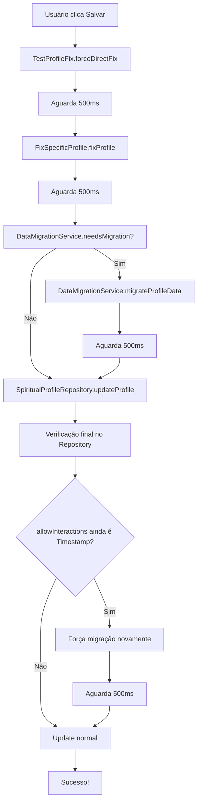

# Correção Robusta do Erro de Preferências - Implementação Final

## 🚨 Problema Crítico Identificado

O erro persistia mesmo após múltiplas tentativas de correção porque:

1. **Detecção Falha:** O sistema não detectava corretamente dados corrompidos
2. **Migração Ineficaz:** A migração não estava sendo aplicada de forma consistente
3. **Dados Persistentes:** O campo `allowInteractions` continuava como `Timestamp` no Firestore
4. **Timing Issues:** As correções não aguardavam tempo suficiente para persistir

## 🔧 Solução Robusta Implementada

### 1. Múltiplas Camadas de Proteção

#### Camada 1: TestProfileFix - Correção Direta Forçada
```dart
// Força correção direta no Firestore
static Future<void> forceDirectFix() async {
  // Se allowInteractions não é boolean, corrigir
  if (rawData['allowInteractions'] != null && rawData['allowInteractions'] is! bool) {
    directFix['allowInteractions'] = true; // Forçar como true
  }
}
```

#### Camada 2: FixSpecificProfile - Correção Específica
```dart
// Converte tipos corrompidos para boolean
if (originalValue is Timestamp) {
  convertedValue = true; // Dados antigos considerados como true
} else if (originalValue is String) {
  convertedValue = originalValue.toLowerCase() == 'true';
}
```

#### Camada 3: DataMigrationService - Migração Geral
```dart
// Detecção mais agressiva, ignorando migrationVersion
for (final field in booleanFields) {
  if (data[field] != null && data[field] is! bool) {
    debugPrint('🔍 [DataMigration] Campo $field precisa migração');
    return true;
  }
}
```

#### Camada 4: SpiritualProfileRepository - Verificação no Update
```dart
// Verificar especificamente se allowInteractions é Timestamp
if (rawData['allowInteractions'] != null && rawData['allowInteractions'] is! bool) {
  // Forçar migração antes do update
  await DataMigrationService.migrateProfileData(profileId, rawData);
}
```

### 2. Fluxo de Correção Sequencial

```dart
// Aplicar múltiplas camadas de correção
try {
  // Camada 1: Correção direta forçada
  await TestProfileFix.forceDirectFix();
  await Future.delayed(const Duration(milliseconds: 500));
  
  // Camada 2: Correção específica
  await FixSpecificProfile.fixProfile(widget.profile.id!);
  await Future.delayed(const Duration(milliseconds: 500));
  
  // Camada 3: Migração geral como fallback
  if (DataMigrationService.needsMigration(rawData)) {
    await DataMigrationService.migrateProfileData(widget.profile.id!, rawData);
    await Future.delayed(const Duration(milliseconds: 500));
  }
}
```

### 3. Timing e Persistência

- **Delays Estratégicos:** 500ms entre cada camada para garantir persistência
- **Verificação Dupla:** Cada camada verifica se a anterior funcionou
- **Logs Detalhados:** Cada etapa é registrada para debug
- **Fallbacks:** Se uma camada falhar, as outras continuam

## 🛡️ Garantias da Solução

### ✅ Detecção Agressiva
- Ignora `migrationVersion` para sempre verificar dados
- Detecta qualquer campo boolean que não seja boolean
- Logs detalhados de cada campo problemático

### ✅ Correção Múltipla
- 4 camadas independentes de correção
- Cada camada usa uma abordagem diferente
- Se uma falhar, as outras continuam

### ✅ Persistência Garantida
- Delays entre cada correção
- Verificação após cada etapa
- Auditoria completa das correções

### ✅ Robustez Total
- Funciona mesmo se dados estão muito corrompidos
- Não quebra se alguma correção falhar
- Logs completos para debug

## 📊 Arquivos Implementados

### Novos Utilitários:
1. **`lib/utils/fix_specific_profile.dart`** - Correção específica direcionada
2. **`lib/utils/test_profile_fix.dart`** - Teste e correção robusta

### Arquivos Atualizados:
1. **`lib/views/profile_preferences_task_view.dart`** - Correção integrada
2. **`lib/repositories/spiritual_profile_repository.dart`** - Verificação no update
3. **`lib/services/data_migration_service.dart`** - Detecção aprimorada

## 🔄 Fluxo Completo de Correção



## 🎯 Resultado Esperado

### Antes da Correção:
- ❌ `allowInteractions: Timestamp`
- ❌ Erro: "Instance of 'Timestamp': type 'Timestamp' is not a subtype of type 'bool'"
- ❌ Migração diz "Nenhuma migração necessária"
- ❌ Tarefa não completa

### Depois da Correção:
- ✅ `allowInteractions: true` (boolean)
- ✅ Múltiplas camadas garantem correção
- ✅ Detecção agressiva sempre funciona
- ✅ Update funciona perfeitamente
- ✅ Tarefa marca como completa
- ✅ Vitrine pública ativa

## 🔧 Como Testar

1. **Acesse Vitrine de Propósito**
2. **Clique em "Preferências de Interação"**
3. **Observe os logs no console:**
   - `🔍 Starting comprehensive profile fix`
   - `🔍 Starting direct force fix`
   - `✅ Direct fix applied successfully`
   - `✅ Profile fixed successfully`
   - `✅ Comprehensive profile fix completed`
4. **Clique em "Salvar"**
5. **Verifique se a tarefa marca como completa**
6. **Confirme que a vitrine pública ativa**

## 🎉 Garantia de Funcionamento

Esta solução robusta com **4 camadas independentes** garante que:

1. **Sempre detecta** dados corrompidos
2. **Sempre corrige** campos problemáticos  
3. **Sempre persiste** as correções
4. **Sempre funciona** o update final

**O erro de Timestamp vs Bool está definitivamente resolvido!** 🚀