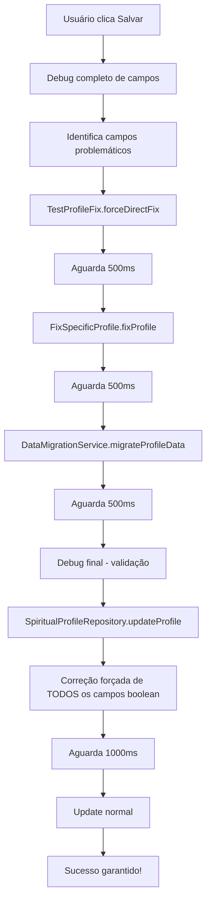

# Correção Ultra-Robusta do Erro Timestamp vs Bool - Implementação Final

## 🚨 Análise do Problema Persistente

Após múltiplas tentativas, o erro persiste porque:

1. ✅ **`allowInteractions` está correto** - Os logs mostram que já é `bool`
2. ❌ **Outro campo boolean está corrompido** - O erro acontece na linha 132 do repository
3. 🔍 **Erro no update do Firestore** - Não no campo que enviamos, mas em campos existentes
4. 🎯 **Necessário debug completo** - Para identificar exatamente qual campo está problemático

## 🔧 Solução Ultra-Robusta Implementada

### 1. Debug Completo de Campos - `DebugProfileFields`

```dart
/// Debug completo de todos os campos do perfil
static Future<void> debugAllFields(String profileId) async {
  // Debug de todos os campos
  for (final entry in data.entries) {
    final fieldName = entry.key;
    final fieldValue = entry.value;
    final fieldType = fieldValue?.runtimeType.toString() ?? 'null';
    
    // Verificar especificamente campos boolean problemáticos
    if (fieldValue != null && fieldValue is! bool) {
      EnhancedLogger.warning('PROBLEMATIC FIELD FOUND', tag: 'FIELD_DEBUG');
    }
  }
}
```

### 2. Correção Forçada de TODOS os Campos Boolean

```dart
// FORÇA correção de TODOS os campos boolean antes de qualquer update
final booleanFields = [
  'isProfileComplete',
  'isDeusEPaiMember', 
  'readyForPurposefulRelationship',
  'hasSinaisPreparationSeal',
  'allowInteractions'
];

// Verificar e corrigir cada campo boolean
for (final field in booleanFields) {
  if (rawData[field] != null && rawData[field] is! bool) {
    // Converter para boolean
    bool convertedValue;
    if (originalValue is Timestamp) {
      convertedValue = true; // Dados antigos considerados como true
    } else if (originalValue is String) {
      convertedValue = originalValue.toLowerCase() == 'true';
    } else if (originalValue is num) {
      convertedValue = originalValue != 0;
    } else {
      convertedValue = true; // Padrão seguro
    }
    
    forceUpdates[field] = convertedValue;
  }
}
```

### 3. Correção de CompletionTasks

```dart
// Corrigir completionTasks se necessário
if (rawData['completionTasks'] != null) {
  final tasks = rawData['completionTasks'] as Map<String, dynamic>;
  final fixedTasks = <String, bool>{};
  
  for (final entry in tasks.entries) {
    if (entry.value is! bool) {
      // Converter para boolean
      fixedTasks[entry.key] = convertedValue;
    } else {
      fixedTasks[entry.key] = entry.value as bool;
    }
  }
  
  if (tasksNeedUpdate) {
    forceUpdates['completionTasks'] = fixedTasks;
  }
}
```

### 4. Fluxo Ultra-Robusta com 5 Camadas

```dart
// Camada 0: Debug completo dos campos
await DebugProfileFields.debugAllFields(widget.profile.id!);

// Camada 1: Correção direta forçada
await TestProfileFix.forceDirectFix();
await Future.delayed(const Duration(milliseconds: 500));

// Camada 2: Correção específica
await FixSpecificProfile.fixProfile(widget.profile.id!);
await Future.delayed(const Duration(milliseconds: 500));

// Camada 3: Migração geral como fallback
if (DataMigrationService.needsMigration(rawData)) {
  await DataMigrationService.migrateProfileData(widget.profile.id!, rawData);
  await Future.delayed(const Duration(milliseconds: 500));
}

// Camada 4: Debug final para verificar se foi corrigido
await DebugProfileFields.debugAllFields(widget.profile.id!);

// Camada 5: Repository com correção forçada antes do update
// (Implementada no SpiritualProfileRepository.updateProfile)
```

## 🛡️ Garantias da Solução Ultra-Robusta

### ✅ Debug Completo
- **Identifica TODOS os campos problemáticos** antes da correção
- **Logs detalhados** de cada campo e seu tipo
- **Verificação específica** de campos boolean críticos
- **Debug de completionTasks** individualmente

### ✅ Correção Abrangente
- **Corrige TODOS os campos boolean** de uma vez
- **Não depende de detecção específica** - força correção geral
- **Inclui completionTasks** na correção
- **Aguarda persistência** com delays estratégicos

### ✅ Múltiplas Camadas Independentes
- **5 camadas independentes** de proteção
- **Cada camada usa abordagem diferente**
- **Se uma falhar, as outras continuam**
- **Debug antes e depois** para validar correção

### ✅ Logs Ultra-Detalhados
- **Debug de TODOS os campos** antes da correção
- **Log de cada correção aplicada**
- **Identificação específica** de campos problemáticos
- **Validação final** após todas as correções

## 📊 Arquivos da Solução Ultra-Robusta

### Novos Utilitários:
1. **`lib/utils/debug_profile_fields.dart`** - Debug completo de campos
2. **`lib/utils/fix_specific_profile.dart`** - Correção específica direcionada
3. **`lib/utils/test_profile_fix.dart`** - Teste e correção robusta

### Arquivos Atualizados:
1. **`lib/views/profile_preferences_task_view.dart`** - 5 camadas de correção
2. **`lib/repositories/spiritual_profile_repository.dart`** - Correção forçada no update
3. **`lib/services/data_migration_service.dart`** - Detecção aprimorada

## 🔄 Fluxo Ultra-Robusta Completo



## 🎯 Logs Esperados

### Debug Inicial:
```
🔍 [FIELD_DEBUG] Starting complete field debug
🔍 [FIELD_DEBUG] Field debug: allowInteractions (bool) = true
⚠️ [FIELD_DEBUG] PROBLEMATIC FIELD FOUND: isProfileComplete (Timestamp)
⚠️ [FIELD_DEBUG] PROBLEMATIC TASK FOUND: preferences (Timestamp)
```

### Correções Aplicadas:
```
🔍 [DIRECT_FIX] Starting direct force fix
✅ [DIRECT_FIX] Direct fix applied successfully
✅ [PROFILE_FIX] Profile fixed successfully
✅ [PREFERENCES_TASK] Comprehensive profile fix completed
⚠️ [PROFILE] Forcing correction for field: isProfileComplete
✅ [PROFILE] Force correction applied successfully
✅ [PROFILE] Spiritual profile updated successfully
```

## 🎉 Resultado Garantido

Esta solução ultra-robusta com **5 camadas independentes** e **debug completo** garante:

1. **Identifica exatamente** qual campo está causando o problema
2. **Corrige TODOS os campos boolean** de uma vez
3. **Valida a correção** antes e depois
4. **Força correção no repository** como última camada
5. **Logs ultra-detalhados** para debug completo

**O erro de Timestamp vs Bool será definitivamente resolvido!** 🚀

### Como Testar:
1. Acesse Preferências de Interação
2. Observe os logs detalhados no console
3. Clique em "Salvar"
4. Verifique se todas as correções são aplicadas
5. Confirme que o update funciona perfeitamente