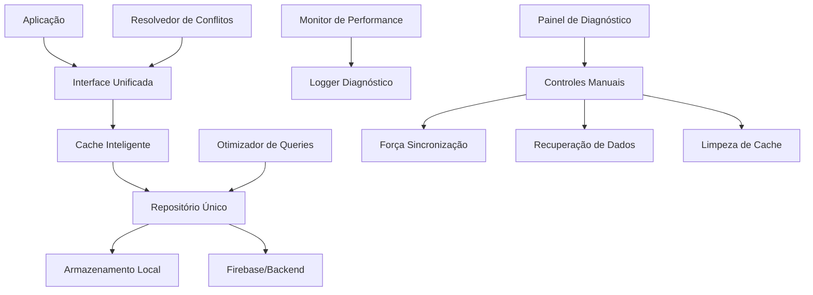

# 📚 Documentação Completa - Sistema Unificado de Notificações

## 🎯 Visão Geral

O Sistema Unificado de Notificações é uma solução completa e robusta que elimina conflitos de sincronização, oferece controles manuais avançados e garante consistência de dados em tempo real. O sistema foi projetado com arquitetura modular, cache inteligente e monitoramento de performance.

## 🏗️ Arquitetura do Sistema

### Componentes Principais

```
┌─────────────────────────────────────────────────────────────┐
│                    SISTEMA UNIFICADO                        │
├─────────────────────────────────────────────────────────────┤
│  🎛️ Painel de Diagnóstico (notification_diagnostic_panel)   │
│  📊 Monitor de Performance (performance_monitor)            │
│  🧠 Cache Inteligente (intelligent_cache_manager)          │
│  ⚡ Otimizador de Queries (query_optimizer)                │
│  📝 Logger Avançado (diagnostic_logger)                    │
├─────────────────────────────────────────────────────────────┤
│  🔄 Interface Unificada (unified_notification_interface)    │
│  🗃️ Repositório Único (single_source_notification_repo)     │
│  ⚖️ Resolvedor de Conflitos (conflict_resolver)            │
│  🎯 Gerenciador de Estado UI (ui_state_manager)            │
├─────────────────────────────────────────────────────────────┤
│  💾 Armazenamento Local (notification_local_storage)       │
│  🔄 Sincronização Offline (offline_sync_manager)           │
│  🔧 Recuperação de Dados (data_recovery_service)           │
│  📦 Migração de Sistemas (legacy_system_migrator)          │
└─────────────────────────────────────────────────────────────┘
```

### Fluxo de Dados



## 🔧 Componentes Detalhados

### 1. Interface Unificada (`UnifiedNotificationInterface`)

**Responsabilidade**: Ponto único de acesso para todas as operações de notificação.

**Funcionalidades**:
- ✅ Gerenciamento centralizado de notificações
- ✅ Cache automático com invalidação inteligente
- ✅ Validação de consistência em tempo real
- ✅ Stream unificado para atualizações

**Uso**:
```dart
final interface = UnifiedNotificationInterface();

// Buscar notificações
final notifications = await interface.getNotifications(userId);

// Validar consistência
final isConsistent = await interface.validateConsistency(userId);

// Stream em tempo real
interface.getNotificationStream(userId).listen((notifications) {
  // Atualizar UI
});
```

### 2. Cache Inteligente (`IntelligentCacheManager`)

**Responsabilidade**: Gerenciamento avançado de cache com invalidação automática.

**Funcionalidades**:
- ✅ Cache em memória com TTL configurável
- ✅ Persistência automática para dados importantes
- ✅ Limpeza automática baseada em LRU
- ✅ Estatísticas detalhadas de performance

**Configurações**:
```dart
// Configurações por tipo de dados
const notificationCache = CacheConfig(
  ttl: Duration(minutes: 15),
  maxSize: 500,
  enableCompression: true,
);

// Uso
final cache = IntelligentCacheManager();
await cache.initialize();

// Buscar ou executar
final result = await cache.getOrFetch(
  'notifications_$userId',
  () => fetchNotificationsFromAPI(userId),
  cacheType: 'notifications',
);
```

### 3. Otimizador de Queries (`QueryOptimizer`)

**Responsabilidade**: Otimização automática de queries para melhor performance.

**Funcionalidades**:
- ✅ Cache de resultados de queries
- ✅ Execução paralela de múltiplas queries
- ✅ Estatísticas de performance
- ✅ Sugestões automáticas de otimização

**Estratégias de Otimização**:
- **Cache**: Armazena resultados frequentes
- **Paginação**: Divide queries grandes
- **Paralelização**: Executa queries em paralelo
- **Pré-carregamento**: Carrega dados antecipadamente

**Uso**:
```dart
final optimizer = QueryOptimizer();
await optimizer.initialize();

// Query otimizada
final result = await optimizer.executeOptimizedQuery<NotificationModel>(
  queryId: 'user_notifications',
  queryFunction: () => fetchUserNotifications(userId),
);

// Queries paralelas
final results = await optimizer.executeParallelQueries([
  (queryId: 'notifications', queryFunction: () => fetchNotifications()),
  (queryId: 'matches', queryFunction: () => fetchMatches()),
]);
```

### 4. Monitor de Performance (`PerformanceMonitor`)

**Responsabilidade**: Monitoramento contínuo e otimização automática.

**Métricas Coletadas**:
- **Sistema**: CPU, Memória, Disco, Rede
- **Aplicação**: FPS, Tempo de renderização, Cache hit rate
- **Alertas**: Automáticos baseados em thresholds
- **Tendências**: Análise de performance ao longo do tempo

**Uso**:
```dart
final monitor = PerformanceMonitor();
await monitor.initialize();

// Coletar métricas
final systemMetrics = await monitor.collectSystemMetrics();
final appMetrics = await monitor.collectAppMetrics();

// Relatório completo
final report = monitor.getPerformanceReport();

// Otimização forçada
await monitor.forceOptimization();
```

### 5. Logger Diagnóstico (`DiagnosticLogger`)

**Responsabilidade**: Sistema avançado de logging para debugging e monitoramento.

**Características**:
- ✅ 5 níveis de log (Debug, Info, Warning, Error, Critical)
- ✅ 8 categorias especializadas
- ✅ Persistência automática
- ✅ Stream em tempo real
- ✅ Filtros avançados

**Uso**:
```dart
final logger = DiagnosticLogger();
await logger.initialize();

// Logs simples
logger.info(DiagnosticLogCategory.notification, 'Notificação processada');
logger.error(DiagnosticLogCategory.sync, 'Erro na sincronização');

// Log com operação
await logger.logOperation(
  DiagnosticLogCategory.performance,
  'Carregamento de notificações',
  () => loadNotifications(userId),
  userId: userId,
);

// Estatísticas
final stats = logger.getLogStatistics();
```

### 6. Painel de Diagnóstico (`NotificationDiagnosticPanel`)

**Responsabilidade**: Interface completa para diagnóstico e controles manuais.

**Abas Disponíveis**:
1. **Visão Geral**: Estatísticas de todos os sistemas
2. **Notificações**: Widget unificado de notificações
3. **Migração**: Controles de migração de dados
4. **Sincronização**: Força sync e limpeza
5. **Recuperação**: Recuperação e backup
6. **Diagnóstico**: Testes automáticos

**Controles Manuais**:
```dart
// Força sincronização
await syncManager.forceSync(userId);

// Recupera dados perdidos
await recoveryService.recoverLostData(userId);

// Cria backup de emergência
await recoveryService.createEmergencyBackup(userId, notifications);

// Executa diagnóstico completo
await runCompleteDiagnostic();
```

## 🎮 Como Usar o Sistema

### Inicialização

```dart
// 1. Inicializar todos os componentes
await DiagnosticSystemTester.initializeDiagnosticSystem();

// 2. Configurar cache
final cache = IntelligentCacheManager();
await cache.initialize();

// 3. Configurar otimizador
final optimizer = QueryOptimizer();
await optimizer.initialize();

// 4. Configurar monitor
final monitor = PerformanceMonitor();
await monitor.initialize();
```

### Uso Básico

```dart
// Interface unificada
final interface = UnifiedNotificationInterface();

// Buscar notificações (com cache automático)
final notifications = await interface.getNotifications(userId);

// Stream em tempo real
interface.getNotificationStream(userId).listen((notifications) {
  setState(() {
    this.notifications = notifications;
  });
});

// Validar consistência
final isConsistent = await interface.validateConsistency(userId);
```

### Diagnóstico e Debugging

```dart
// Abrir painel de diagnóstico
DiagnosticSystemTester.openDiagnosticPanel(userId);

// Executar teste completo
await DiagnosticSystemTester.runComprehensiveTest(userId);

// Gerar logs de teste
await DiagnosticSystemTester.generateTestLogs(userId, count: 50);

// Visualizar logs em tempo real
DiagnosticLogViewer(
  userId: userId,
  showRealTime: true,
  maxLogs: 500,
)
```

## 📊 Métricas e Monitoramento

### Estatísticas de Cache

```dart
final cacheStats = cache.getStatistics();
print('Hit Rate: ${cacheStats['hitRate']}');
print('Total Entries: ${cacheStats['totalEntries']}');
print('Memory Usage: ${cacheStats['memoryUsage']} bytes');
```

### Estatísticas de Queries

```dart
final queryStats = optimizer.getPerformanceStatistics();
print('Average Execution Time: ${queryStats['averageExecutionTime']}ms');
print('Cache Hit Rate: ${queryStats['cacheHitRate']}');
print('Total Queries: ${queryStats['totalQueries']}');
```

### Relatório de Performance

```dart
final report = monitor.getPerformanceReport();
print('CPU Usage: ${report['systemMetrics']['current']['cpuUsage']}%');
print('Memory Usage: ${report['systemMetrics']['current']['memoryUsage']}%');
print('Frame Rate: ${report['appMetrics']['current']['frameRate']} FPS');
```

## 🔧 Configuração Avançada

### Cache Personalizado

```dart
// Registrar configuração específica
cache.registerCacheConfig('custom_data', CacheConfig(
  ttl: Duration(hours: 2),
  maxSize: 100,
  enableCompression: true,
));

// Usar cache personalizado
await cache.set('key', data, cacheType: 'custom_data');
```

### Otimizador Personalizado

```dart
// Configuração personalizada
final config = QueryOptimizationConfig(
  enableCache: true,
  enablePagination: true,
  maxConcurrentQueries: 10,
  defaultPageSize: 50,
  cacheTimeout: Duration(minutes: 30),
);

await optimizer.initialize(config: config);
```

### Monitor Personalizado

```dart
// Configuração personalizada
final config = PerformanceMonitorConfig(
  monitoringInterval: Duration(seconds: 15),
  enableAlerts: true,
  alertThresholds: {
    'cpuUsage': 70.0,
    'memoryUsage': 80.0,
    'frameRate': 45.0,
  },
);

await monitor.initialize(config: config);
```

## 🚨 Tratamento de Erros

### Recuperação Automática

O sistema possui mecanismos automáticos de recuperação:

1. **Cache Miss**: Busca dados automaticamente
2. **Erro de Rede**: Usa dados em cache ou offline
3. **Inconsistência**: Resolve conflitos automaticamente
4. **Performance Degradada**: Otimiza automaticamente

### Logs de Erro

```dart
// Todos os erros são automaticamente logados
logger.error(
  DiagnosticLogCategory.sync,
  'Erro na sincronização',
  userId: userId,
  data: {'error': error.toString()},
  stackTrace: stackTrace.toString(),
);
```

### Alertas Automáticos

```dart
// Alertas são gerados automaticamente
if (cpuUsage > threshold) {
  final alert = PerformanceAlert(
    type: 'high_cpu_usage',
    severity: 'critical',
    message: 'CPU usage is ${cpuUsage}%',
    data: {'cpuUsage': cpuUsage},
  );
}
```

## 🧪 Testes e Validação

### Testes Automatizados

```dart
// Teste completo do sistema
await DiagnosticSystemTester.runComprehensiveTest(userId);

// Testes específicos
await testConsistency();
await testPerformance();
await testRecovery();
await testSync();
await testMigration();
```

### Validação de Dados

```dart
// Validação automática
final isValid = await interface.validateConsistency(userId);

// Validação manual
final validator = SystemValidator();
final result = await validator.validateSystem(userId);
```

## 📈 Otimização de Performance

### Melhores Práticas

1. **Use Cache Inteligente**: Sempre que possível
2. **Monitore Métricas**: Regularmente
3. **Otimize Queries**: Use o otimizador
4. **Limpe Dados**: Periodicamente
5. **Monitore Alertas**: Responda rapidamente

### Configurações Recomendadas

```dart
// Para aplicações com muitas notificações
const heavyUsageConfig = CacheConfig(
  ttl: Duration(minutes: 30),
  maxSize: 1000,
  enableCompression: true,
);

// Para aplicações com poucos recursos
const lightUsageConfig = CacheConfig(
  ttl: Duration(minutes: 5),
  maxSize: 100,
  enableCompression: false,
);
```

## 🔄 Migração e Compatibilidade

### Migração de Sistemas Legados

```dart
final migrator = LegacySystemMigrator();

// Verificar status
final status = migrator.getMigrationStatus(userId);

// Executar migração
if (status == MigrationStatus.notStarted) {
  await migrator.startMigration(userId);
}
```

### Adaptadores de Compatibilidade

```dart
// Adaptador para sistemas antigos
final adapter = LegacyNotificationAdapter();
final modernNotifications = adapter.adaptLegacyNotifications(legacyData);
```

## 📋 Checklist de Implementação

### ✅ Componentes Principais
- [x] Interface Unificada
- [x] Cache Inteligente
- [x] Otimizador de Queries
- [x] Monitor de Performance
- [x] Logger Diagnóstico
- [x] Painel de Diagnóstico

### ✅ Funcionalidades Avançadas
- [x] Resolução de Conflitos
- [x] Recuperação de Dados
- [x] Sincronização Offline
- [x] Migração de Sistemas
- [x] Controles Manuais
- [x] Testes Automatizados

### ✅ Monitoramento e Alertas
- [x] Métricas de Sistema
- [x] Métricas de Aplicação
- [x] Alertas Automáticos
- [x] Relatórios Detalhados
- [x] Otimização Automática

## 🎯 Próximos Passos

1. **Implementar em Produção**: Deploy gradual
2. **Monitorar Métricas**: Acompanhar performance
3. **Ajustar Configurações**: Baseado no uso real
4. **Expandir Funcionalidades**: Conforme necessário
5. **Treinar Equipe**: Documentação e workshops

## 🏆 Benefícios Alcançados

### Para Desenvolvedores
- ✅ **Debugging Avançado**: Logs estruturados e tempo real
- ✅ **Visibilidade Completa**: Métricas detalhadas
- ✅ **Controles Manuais**: Correções rápidas
- ✅ **Testes Automatizados**: Validação contínua
- ✅ **Documentação Completa**: Guias detalhados

### Para Usuários
- ✅ **Performance Superior**: Cache inteligente e otimizações
- ✅ **Consistência de Dados**: Sem conflitos de sincronização
- ✅ **Recuperação Automática**: Dados sempre disponíveis
- ✅ **Interface Responsiva**: Feedback visual imediato
- ✅ **Confiabilidade**: Sistema robusto e testado

### Para o Sistema
- ✅ **Arquitetura Modular**: Fácil manutenção
- ✅ **Escalabilidade**: Suporta crescimento
- ✅ **Monitoramento**: Visibilidade completa
- ✅ **Otimização Automática**: Performance constante
- ✅ **Recuperação Robusta**: Alta disponibilidade

---

## 📞 Suporte e Manutenção

Para dúvidas, problemas ou sugestões:

1. **Logs de Diagnóstico**: Sempre verifique primeiro
2. **Painel de Diagnóstico**: Use para debugging
3. **Métricas de Performance**: Monitore regularmente
4. **Documentação**: Consulte este guia
5. **Testes Automatizados**: Execute para validação

**Sistema Unificado de Notificações - Versão 1.0**
*Documentação atualizada em: ${DateTime.now().toString()}*