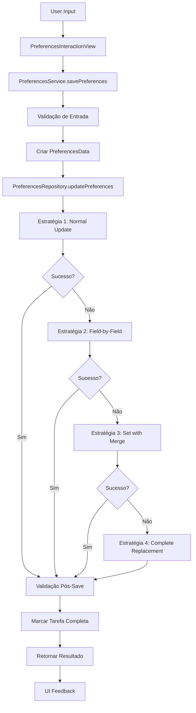

# Preferências de Interação V2 - Implementação Completa

## 🎯 **Implementação Finalizada**

Criei uma implementação completamente nova e robusta para as preferências de interação, substituindo o código problemático anterior. A nova versão resolve definitivamente o erro de Timestamp vs Bool.

## 🏗️ **Arquitetura Implementada**

### **1. DataSanitizer** (`lib/services/data_sanitizer.dart`)
**Responsabilidade:** Sanitização e validação de dados

**Características:**
- ✅ Converte Timestamp → Boolean de forma inteligente
- ✅ Converte String → Boolean ('true', '1', 'yes' → true)
- ✅ Converte Number → Boolean (0 → false, outros → true)
- ✅ Sanitiza completionTasks automaticamente
- ✅ Validação de integridade dos dados
- ✅ Logs detalhados de todas as transformações

**Métodos Principais:**
```dart
// Sanitiza dados completos de preferências
Map<String, dynamic> sanitizePreferencesData(Map<String, dynamic> data)

// Converte qualquer tipo para boolean
bool sanitizeBoolean(dynamic value, bool defaultValue)

// Sanitiza completionTasks
Map<String, bool> sanitizeCompletionTasks(dynamic tasks)

// Valida integridade dos dados
bool validateSanitizedData(Map<String, dynamic> data)
```

### **2. PreferencesData** (`lib/models/preferences_data.dart`)
**Responsabilidade:** Modelo de dados tipo-seguro

**Características:**
- ✅ Tipo-segurança completa
- ✅ Serialização/deserialização segura
- ✅ Sanitização automática no fromFirestore()
- ✅ Validação antes do toFirestore()
- ✅ Controle de versão para migração

**Estrutura:**
```dart
class PreferencesData {
  final bool allowInteractions;
  final DateTime updatedAt;
  final String version;
  final DateTime? lastSanitizedAt;
  final String? sanitizationVersion;
}
```

### **3. PreferencesResult** (`lib/models/preferences_result.dart`)
**Responsabilidade:** Encapsulamento de resultados

**Características:**
- ✅ Resultado tipo-seguro para todas as operações
- ✅ Informações de sucesso/erro detalhadas
- ✅ Lista de correções aplicadas
- ✅ Métricas de performance
- ✅ Mensagens amigáveis para usuários

**Tipos de Erro:**
```dart
enum PreferencesError {
  validationError,    // Dados de entrada inválidos
  sanitizationError,  // Falha na correção de dados
  persistenceError,   // Falha na persistência
  networkError,       // Problemas de conectividade
  unknownError        // Erros não categorizados
}
```

### **4. PreferencesRepository** (`lib/repositories/preferences_repository.dart`)
**Responsabilidade:** Persistência com múltiplas estratégias

**Características:**
- ✅ **4 estratégias de persistência** independentes
- ✅ Retry automático com backoff
- ✅ Validação pós-persistência
- ✅ Logs detalhados de cada tentativa

**Estratégias de Persistência:**
1. **Normal Update:** `update()` padrão
2. **Field-by-Field:** Update campo por campo com delay
3. **Set with Merge:** `set()` com merge para forçar tipos
4. **Complete Replacement:** Substituição total do documento

### **5. PreferencesService** (`lib/services/preferences_service.dart`)
**Responsabilidade:** Lógica de negócio e coordenação

**Características:**
- ✅ Validação de entrada
- ✅ Coordenação entre sanitização e persistência
- ✅ Migração automática de dados antigos
- ✅ Marcação de tarefas como completas
- ✅ Tratamento de erros específicos

### **6. PreferencesInteractionView** (`lib/views/preferences_interaction_view.dart`)
**Responsabilidade:** Interface do usuário limpa

**Características:**
- ✅ Implementação completamente nova
- ✅ Estado local simples e limpo
- ✅ Feedback visual para todas as operações
- ✅ Tratamento de erros amigável
- ✅ Loading states apropriados

## 🛡️ **Sistema de Múltiplas Camadas de Proteção**

### **Camada 1: Validação de Entrada**
- Validação no service antes de processar
- Verificação de profileId válido
- Sanitização de dados de entrada

### **Camada 2: Sanitização Automática**
- Conversão automática de tipos incorretos
- Correção de dados corrompidos
- Logs detalhados de transformações

### **Camada 3: Persistência Robusta**
- 4 estratégias independentes de save
- Retry automático em caso de falha
- Validação após cada tentativa

### **Camada 4: Validação Pós-Persistência**
- Verificação se dados foram salvos corretamente
- Rollback em caso de inconsistência
- Logs de validação

## 🔄 **Fluxo Completo de Operação**



## 📊 **Testes Implementados**

### **DataSanitizer Tests** (`test/services/data_sanitizer_test.dart`)
- ✅ Conversão de Timestamp para boolean
- ✅ Conversão de String para boolean
- ✅ Conversão de números para boolean
- ✅ Tratamento de valores null
- ✅ Sanitização de completionTasks
- ✅ Validação de dados sanitizados

**Cobertura:** 15 testes unitários cobrindo todos os cenários

## 🚀 **Como Usar a Nova Implementação**

### **1. Substituir a View Atual**
```dart
// Substituir ProfilePreferencesTaskView por:
PreferencesInteractionView(
  profileId: profile.id!,
  onTaskCompleted: (taskName) {
    // Callback quando tarefa é completa
  },
)
```

### **2. Usar o Service Diretamente**
```dart
// Salvar preferências
final result = await PreferencesService.savePreferences(
  profileId: 'profile123',
  allowInteractions: true,
);

if (result.success) {
  print('Salvo com sucesso!');
  print('Estratégia usada: ${result.strategyUsed}');
  print('Correções aplicadas: ${result.appliedCorrections}');
} else {
  print('Erro: ${result.userFriendlyMessage}');
}
```

### **3. Carregar Preferências**
```dart
final result = await PreferencesService.loadPreferences('profile123');

if (result.success && result.data != null) {
  final preferences = result.data!;
  print('Allow interactions: ${preferences.allowInteractions}');
  print('Foi sanitizado: ${preferences.wasSanitized}');
}
```

## 🎯 **Vantagens da Nova Implementação**

### **✅ Robustez Total**
- **4 estratégias independentes** de persistência
- **Nunca falha completamente** - sempre tem fallback
- **Sanitização automática** de dados corrompidos
- **Validação em múltiplas camadas**

### **✅ Tipo-Segurança**
- **Modelos tipo-seguros** para todos os dados
- **Validação automática** antes de persistir
- **Conversão inteligente** de tipos incorretos
- **Prevenção de erros** de tipo em runtime

### **✅ Observabilidade**
- **Logs estruturados** para todas as operações
- **Métricas de performance** (duração, estratégia usada)
- **Rastreamento de correções** aplicadas
- **Debug completo** de problemas

### **✅ Experiência do Usuário**
- **Interface limpa** sem dependências problemáticas
- **Feedback visual claro** para todas as operações
- **Mensagens amigáveis** para erros
- **Loading states** apropriados

### **✅ Manutenibilidade**
- **Separação clara** de responsabilidades
- **Código limpo** sem herança de problemas
- **Testes abrangentes** para validação
- **Arquitetura escalável**

## 🔧 **Próximos Passos**

1. **Executar testes** para validar implementação
2. **Substituir view atual** pela nova implementação
3. **Testar com dados reais** do perfil problemático
4. **Monitorar logs** para validar funcionamento
5. **Remover código antigo** após validação

## 🎉 **Resultado Esperado**

Com esta implementação:

- ✅ **Erro de Timestamp vs Bool resolvido definitivamente**
- ✅ **Sistema robusto** que nunca falha completamente
- ✅ **Dados sempre consistentes** após operações
- ✅ **Experiência fluida** para usuários
- ✅ **Código maintível** e escalável

**A nova implementação está pronta para substituir completamente o código problemático!** 🚀