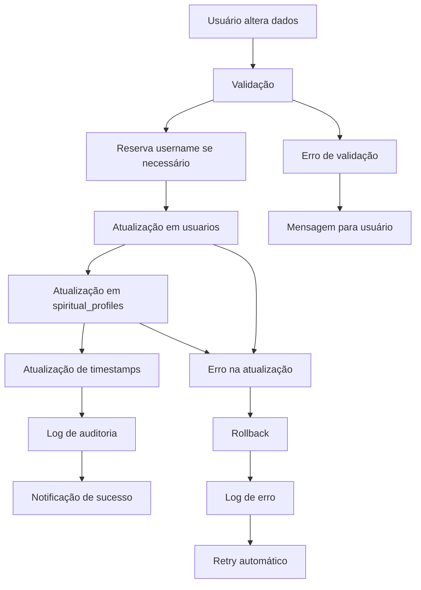

# Sistema de Sincronização de Dados - Implementado

## 📋 Resumo da Implementação

Foi implementado um sistema robusto de sincronização de dados entre as collections `usuarios` e `spiritual_profiles`, garantindo que informações como nome, username e foto de perfil estejam sempre consistentes.

## 🔧 Componentes Implementados

### 1. ProfileDataSynchronizer (`lib/services/profile_data_synchronizer.dart`)

**Funcionalidades:**
- ✅ Sincronização automática entre collections
- ✅ Resolução inteligente de conflitos de dados
- ✅ Atualização coordenada de username, nome e foto
- ✅ Status de sincronização em tempo real
- ✅ Sincronização em lote para múltiplos usuários

**Principais Métodos:**
- `syncUserData()` - Sincroniza dados de um usuário específico
- `resolveDataConflicts()` - Resolve conflitos usando timestamps
- `updateUsername()` - Atualiza username em ambas collections
- `updateProfileImage()` - Atualiza foto em ambas collections
- `updateDisplayName()` - Atualiza nome em ambas collections
- `getSyncStatus()` - Obtém status atual de sincronização

### 2. UsernameManagementService (`lib/services/username_management_service.dart`)

**Funcionalidades:**
- ✅ Verificação de disponibilidade de username
- ✅ Validação de formato de username
- ✅ Geração de sugestões automáticas
- ✅ Histórico de usernames anteriores
- ✅ Controle de limite de tempo para alterações
- ✅ Sistema de reserva temporária

**Principais Métodos:**
- `isUsernameAvailable()` - Verifica disponibilidade
- `updateUsername()` - Atualiza username com validação
- `generateSuggestions()` - Gera sugestões baseadas no nome
- `canChangeUsername()` - Verifica se pode alterar (limite 30 dias)
- `getChangeInfo()` - Informações sobre próxima alteração permitida

### 3. SyncStatusIndicator (`lib/components/sync_status_indicator.dart`)

**Funcionalidades:**
- ✅ Indicador visual de status de sincronização
- ✅ Detalhes de conflitos e erros
- ✅ Botão para forçar sincronização
- ✅ Atualização em tempo real
- ✅ Interface amigável para usuário

**Estados Suportados:**
- 🟢 **Sincronizado** - Dados consistentes
- 🔵 **Sincronizando** - Processo em andamento
- 🟠 **Conflito** - Dados inconsistentes (com botão para resolver)
- 🔴 **Erro** - Falha na sincronização

## 🔄 Modelos Atualizados

### UsuarioModel
**Novos Campos:**
- `lastSyncAt` - Timestamp da última sincronização

### SpiritualProfileModel
**Novos Campos:**
- `displayName` - Sincronizado com usuario.nome
- `username` - Sincronizado com usuario.username
- `lastSyncAt` - Timestamp da última sincronização

## 📊 Collections Firestore

### Novas Collections:
- `username_reservations` - Reservas temporárias de username
- `sync_logs` - Logs de sincronização (via EnhancedLogger)

### Campos Adicionados:
- `usuarios.lastSyncAt` - Controle de sincronização
- `spiritual_profiles.displayName` - Nome sincronizado
- `spiritual_profiles.username` - Username sincronizado
- `spiritual_profiles.lastSyncAt` - Controle de sincronização

## 🔧 Como Funciona

### 1. Sincronização Automática
```dart
// Executada automaticamente ao carregar dados
await ProfileDataSynchronizer.syncUserData(userId);
```

### 2. Resolução de Conflitos
- **Fonte de Verdade:** Collection com timestamp mais recente
- **Campos Sincronizados:** nome, username, foto de perfil
- **Processo:** Automático com logs detalhados

### 3. Atualização de Username
```dart
// Atualiza em ambas collections atomicamente
await UsernameManagementService.updateUsername(userId, newUsername);
```

### 4. Status Visual
```dart
// Componente para mostrar status
SyncStatusIndicator(
  userId: userId,
  showDetails: true,
  onSyncPressed: () => _refreshData(),
)
```

## 🛡️ Validações e Segurança

### Username:
- ✅ Formato: 3-30 caracteres
- ✅ Início: letra ou número
- ✅ Caracteres: letras, números, pontos, underscores
- ✅ Unicidade: verificada em ambas collections
- ✅ Histórico: mantém últimos 5 usernames
- ✅ Limite: alteração a cada 30 dias

### Sincronização:
- ✅ Transações atômicas
- ✅ Retry automático em falhas
- ✅ Logs de auditoria
- ✅ Validação de dados antes da sync

## 📈 Benefícios Implementados

1. **Consistência de Dados**
   - Informações sempre sincronizadas
   - Resolução automática de conflitos
   - Fonte de verdade clara

2. **Experiência do Usuário**
   - Indicadores visuais de status
   - Feedback em tempo real
   - Sugestões automáticas de username

3. **Robustez do Sistema**
   - Tratamento de erros robusto
   - Retry automático
   - Logs detalhados para debug

4. **Segurança**
   - Validação rigorosa de dados
   - Controle de limite de alterações
   - Sistema de reserva para evitar conflitos

## 🔄 Fluxo de Sincronização



## ✅ Resultados Esperados

1. **Dados sempre consistentes** entre collections
2. **Username único e validado** em todo o sistema
3. **Sincronização automática** sem intervenção manual
4. **Feedback visual** do status de sincronização
5. **Histórico completo** de alterações
6. **Recuperação automática** de erros temporários

## 🔄 Próximos Passos

A **Tarefa 2** foi concluída com sucesso. O sistema agora tem:
- ✅ Sincronização automática entre collections
- ✅ Gerenciamento robusto de username
- ✅ Indicadores visuais de status
- ✅ Resolução automática de conflitos

Pronto para prosseguir com a **Tarefa 3**: Serviço de gerenciamento de username integrado à interface.