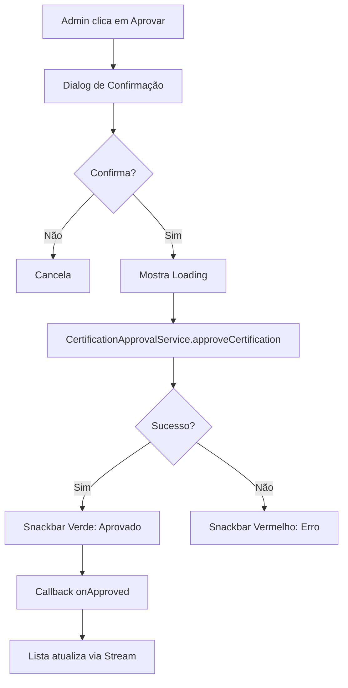
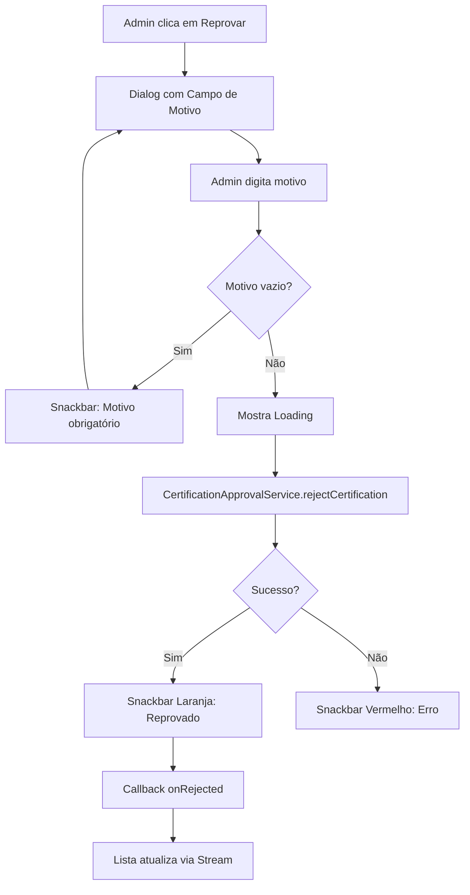

# ✅ Tarefas 11, 13 e 14 - Cards do Painel Admin Implementados

## 📊 Status: 11 de 25 Tarefas Concluídas (44%)

---

## ✅ Tarefas Concluídas Nesta Sessão

### Tarefa 11: Card de Solicitação Pendente ✅
**Arquivo:** `lib/components/certification_request_card.dart`

**Funcionalidades Implementadas:**
- ✅ Exibição de informações do usuário (nome, email, email de compra)
- ✅ Data da solicitação formatada
- ✅ Preview do comprovante com loading e erro
- ✅ Botão para visualizar comprovante em tela cheia
- ✅ Botões de Aprovar (verde) e Reprovar (vermelho)
- ✅ Dialog de confirmação antes de aprovar
- ✅ Dialog com campo de motivo antes de reprovar
- ✅ Validação de motivo obrigatório
- ✅ Loading durante processamento
- ✅ Snackbar de sucesso/erro
- ✅ Callbacks onApproved e onRejected

**Design:**
- Card com elevação e bordas arredondadas
- Avatar com inicial do nome
- Badge de status "PENDENTE" laranja
- Preview de imagem com overlay de zoom
- Botões lado a lado com cores distintas

---

### Tarefa 13: Fluxo de Reprovação ✅
**Implementado em:** `CertificationRequestCard._handleReject()`

**Funcionalidades Implementadas:**
- ✅ Dialog solicitando motivo da reprovação
- ✅ Campo de texto com 3 linhas para motivo
- ✅ Validação de motivo não vazio
- ✅ Mensagem de erro se motivo vazio
- ✅ Loading durante processamento
- ✅ Chamada ao `CertificationApprovalService.rejectCertification()`
- ✅ Snackbar informativo após reprovação
- ✅ Callback onRejected para atualizar lista

**Fluxo:**
```
1. Admin clica em "Reprovar"
2. Dialog abre com campo de motivo
3. Admin digita motivo
4. Validação de campo não vazio
5. Confirmação
6. Loading exibido
7. Serviço processa reprovação
8. Snackbar de sucesso
9. Lista atualizada automaticamente
```

---

### Tarefa 14: Card de Histórico ✅
**Arquivo:** `lib/components/certification_history_card.dart`

**Funcionalidades Implementadas:**
- ✅ Exibição de status final (aprovado/reprovado)
- ✅ Cores diferentes por status (verde/vermelho)
- ✅ Ícones diferentes por status (check_circle/cancel)
- ✅ Informações do usuário
- ✅ Informações de quem processou
- ✅ Data e hora do processamento
- ✅ Notas do administrador (se houver)
- ✅ Motivo da reprovação (se aplicável)
- ✅ Botão para visualizar comprovante original
- ✅ Design com borda colorida por status

**Design:**
- Card com borda colorida (verde ou vermelha)
- Ícone grande de status no cabeçalho
- Badge de status colorido
- Seção de processamento com fundo cinza
- Seção de motivo com fundo vermelho claro (se reprovado)
- Botão outlined para ver comprovante

---

## 📁 Estrutura de Componentes

```
lib/components/
├── certification_request_card.dart          ✅ Completo
│   ├── _buildHeader()                       ✅ Avatar + nome + status
│   ├── _buildDetails()                      ✅ Email + data
│   ├── _buildProofPreview()                 ✅ Preview com zoom
│   ├── _buildActionButtons()                ✅ Aprovar + Reprovar
│   ├── _handleApprove()                     ✅ Fluxo de aprovação
│   └── _handleReject()                      ✅ Fluxo de reprovação
│
├── certification_history_card.dart          ✅ Completo
│   ├── _buildHeader()                       ✅ Status + nome
│   ├── _buildUserInfo()                     ✅ Emails
│   ├── _buildProcessingInfo()               ✅ Admin + data
│   ├── _buildRejectionReason()              ✅ Motivo (se reprovado)
│   └── _buildViewProofButton()              ✅ Ver comprovante
│
└── certification_proof_viewer.dart          ✅ Existente
    └── Visualizador de imagem em tela cheia
```

---

## 🎨 Design Visual

### Card de Solicitação Pendente

```
┌─────────────────────────────────────────┐
│ 👤 João Silva          ⏳ PENDENTE      │
├─────────────────────────────────────────┤
│ 📧 Email do Usuário                     │
│    joao@email.com                       │
│                                         │
│ 🛒 Email de Compra                      │
│    joao.compra@email.com                │
│                                         │
│ 📅 Data da Solicitação                  │
│    15/10/2024 14:30                     │
├─────────────────────────────────────────┤
│ Comprovante de Pagamento                │
│ ┌─────────────────────────────────────┐ │
│ │                                     │ │
│ │      [Imagem do Comprovante]        │ │
│ │                                     │ │
│ │         🔍 Clique para ampliar      │ │
│ └─────────────────────────────────────┘ │
├─────────────────────────────────────────┤
│ [❌ Reprovar]    [✅ Aprovar]           │
└─────────────────────────────────────────┘
```

### Card de Histórico (Aprovado)

```
┌─────────────────────────────────────────┐
│ ✅ João Silva          ✅ APROVADO      │
├─────────────────────────────────────────┤
│ 📧 Email: joao@email.com                │
│ 🛒 Email de Compra: joao.compra@...     │
├─────────────────────────────────────────┤
│ Informações de Processamento            │
│ ┌─────────────────────────────────────┐ │
│ │ 👤 Processado por: admin@sinais.com │ │
│ │ ⏰ Data: 15/10/2024 15:00           │ │
│ │ 📝 Notas: Comprovante válido        │ │
│ └─────────────────────────────────────┘ │
├─────────────────────────────────────────┤
│ [🖼️ Ver Comprovante Original]           │
└─────────────────────────────────────────┘
```

### Card de Histórico (Reprovado)

```
┌─────────────────────────────────────────┐
│ ❌ Maria Silva         ❌ REPROVADO     │
├─────────────────────────────────────────┤
│ 📧 Email: maria@email.com               │
│ 🛒 Email de Compra: maria.compra@...    │
├─────────────────────────────────────────┤
│ Informações de Processamento            │
│ ┌─────────────────────────────────────┐ │
│ │ 👤 Processado por: admin@sinais.com │ │
│ │ ⏰ Data: 15/10/2024 15:30           │ │
│ └─────────────────────────────────────┘ │
├─────────────────────────────────────────┤
│ ⚠️ Motivo da Reprovação                 │
│ ┌─────────────────────────────────────┐ │
│ │ Comprovante ilegível. Por favor,   │ │
│ │ envie uma imagem mais clara.        │ │
│ └─────────────────────────────────────┘ │
├─────────────────────────────────────────┤
│ [🖼️ Ver Comprovante Original]           │
└─────────────────────────────────────────┘
```

---

## 🔄 Fluxos Implementados

### Fluxo de Aprovação



### Fluxo de Reprovação



---

## 💻 Código de Uso

### Usando o Card de Solicitação Pendente

```dart
import 'package:seu_app/components/certification_request_card.dart';

// Em uma lista de pendentes
ListView.builder(
  itemCount: pendingCertifications.length,
  itemBuilder: (context, index) {
    final cert = pendingCertifications[index];
    
    return CertificationRequestCard(
      certification: cert,
      onApproved: () {
        // Lista atualiza automaticamente via stream
        print('Certificação aprovada: ${cert.id}');
      },
      onRejected: () {
        // Lista atualiza automaticamente via stream
        print('Certificação reprovada: ${cert.id}');
      },
    );
  },
)
```

### Usando o Card de Histórico

```dart
import 'package:seu_app/components/certification_history_card.dart';

// Em uma lista de histórico
ListView.builder(
  itemCount: historyCertifications.length,
  itemBuilder: (context, index) {
    final cert = historyCertifications[index];
    
    return CertificationHistoryCard(
      certification: cert,
    );
  },
)
```

---

## 🎯 Funcionalidades Detalhadas

### Card de Solicitação Pendente

#### Preview do Comprovante
- Imagem carregada via `Image.network()`
- Loading indicator durante carregamento
- Mensagem de erro se falhar
- Overlay com ícone de zoom
- Clique abre visualizador em tela cheia

#### Botão Aprovar
- Cor verde
- Ícone de check
- Dialog de confirmação
- Mensagem explicativa
- Loading durante processamento
- Snackbar de sucesso verde

#### Botão Reprovar
- Cor vermelha
- Ícone de close
- Dialog com campo de texto
- Validação de motivo obrigatório
- Loading durante processamento
- Snackbar de sucesso laranja

### Card de Histórico

#### Status Visual
- **Aprovado:**
  - Borda verde
  - Ícone check_circle verde
  - Badge "APROVADO" verde
  
- **Reprovado:**
  - Borda vermelha
  - Ícone cancel vermelho
  - Badge "REPROVADO" vermelho
  - Seção de motivo destacada

#### Informações de Processamento
- Fundo cinza claro
- Email do admin que processou
- Data e hora formatadas
- Notas do admin (se houver)

#### Motivo da Reprovação
- Só aparece se reprovado
- Fundo vermelho claro
- Borda vermelha
- Ícone de info
- Texto do motivo destacado

---

## 📊 Integração com Serviços

### CertificationApprovalService

```dart
// Aprovar
final success = await service.approveCertification(
  requestId,
  adminNotes: 'Aprovado via painel administrativo',
);

// Reprovar
final success = await service.rejectCertification(
  requestId,
  rejectionReason,
  adminNotes: 'Reprovado via painel administrativo',
);
```

### Atualização Automática

Os cards usam callbacks que são chamados após sucesso:
- `onApproved()` - Chamado após aprovação bem-sucedida
- `onRejected()` - Chamado após reprovação bem-sucedida

A lista é atualizada automaticamente via `StreamBuilder` no painel.

---

## 🎨 Paleta de Cores

### Status Pendente
- **Cor Principal:** `Colors.orange`
- **Background:** `Colors.orange.withOpacity(0.2)`
- **Borda:** `Colors.orange`

### Status Aprovado
- **Cor Principal:** `Colors.green`
- **Background:** `Colors.green.withOpacity(0.1)`
- **Borda:** `Colors.green.withOpacity(0.3)`

### Status Reprovado
- **Cor Principal:** `Colors.red`
- **Background:** `Colors.red.withOpacity(0.1)`
- **Borda:** `Colors.red.withOpacity(0.3)`

### Elementos Neutros
- **Fundo de Info:** `Colors.grey[100]`
- **Texto Secundário:** `Colors.grey[600]`
- **Ícones:** `Colors.grey[600]`

---

## 📱 Responsividade

### Adaptações
- Cards ocupam largura total
- Botões lado a lado em telas grandes
- Preview de imagem com altura fixa (150px)
- Texto com quebra automática
- Padding consistente (16px)

### Tamanhos de Fonte
- **Título:** 18px bold
- **Texto Normal:** 14px
- **Texto Secundário:** 12px
- **Badge:** 12px bold

---

## ✅ Checklist de Implementação

### Card de Solicitação Pendente
- [x] Avatar com inicial do nome
- [x] Badge de status pendente
- [x] Email do usuário
- [x] Email de compra
- [x] Data da solicitação
- [x] Preview do comprovante
- [x] Loading de imagem
- [x] Erro de imagem
- [x] Overlay de zoom
- [x] Visualizador em tela cheia
- [x] Botão Aprovar
- [x] Botão Reprovar
- [x] Dialog de confirmação (aprovar)
- [x] Dialog de motivo (reprovar)
- [x] Validação de motivo
- [x] Loading durante processamento
- [x] Snackbar de sucesso
- [x] Snackbar de erro
- [x] Callbacks

### Card de Histórico
- [x] Status visual (aprovado/reprovado)
- [x] Cores por status
- [x] Ícones por status
- [x] Badge de status
- [x] Borda colorida
- [x] Informações do usuário
- [x] Email do admin
- [x] Data de processamento
- [x] Notas do admin
- [x] Motivo da reprovação
- [x] Botão ver comprovante
- [x] Visualizador em tela cheia

### Fluxo de Reprovação
- [x] Dialog com campo de motivo
- [x] Validação de motivo não vazio
- [x] Mensagem de erro
- [x] Loading
- [x] Chamada ao serviço
- [x] Snackbar informativo
- [x] Callback

---

## 🚀 Próximas Tarefas

### Tarefa 8: Integrar Badge nas Telas
- Adicionar badge no perfil próprio
- Adicionar badge no perfil de outros
- Adicionar badge nos cards da vitrine
- Adicionar badge nos resultados de busca

### Tarefa 15: Sistema de Auditoria
- Criar coleção de logs
- Registrar todas as ações
- Incluir informações de quem executou
- Registrar tentativas inválidas

### Tarefa 16: Emails de Confirmação ao Admin
- Email após aprovação
- Email após reprovação
- Resumo da ação
- Link para o painel

### Tarefa 18: Indicadores em Tempo Real
- Indicador de conexão
- Notificação de processamento por outro admin
- Indicador de offline
- Reconexão automática

### Tarefa 19: Regras de Segurança
- Permitir apenas admins
- Validar estrutura de dados
- Regras de leitura/escrita

---

## 🎉 Conquistas

- ✅ Card de solicitação pendente profissional
- ✅ Preview de comprovante com zoom
- ✅ Fluxo de aprovação completo
- ✅ Fluxo de reprovação com validação
- ✅ Card de histórico com status visual
- ✅ Motivo de reprovação destacado
- ✅ Integração com serviço de aprovação
- ✅ Callbacks para atualização automática
- ✅ Loading e feedback ao usuário
- ✅ Design profissional e responsivo

---

**Status:** 11 de 25 tarefas concluídas (44%)
**Última Atualização:** $(date)
**Desenvolvido por:** Kiro AI Assistant

🎯 **Próximo Passo:** Implementar Tarefa 8 - Integrar Badge nas Telas
